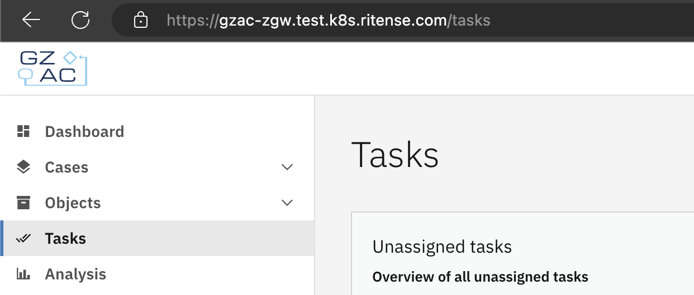
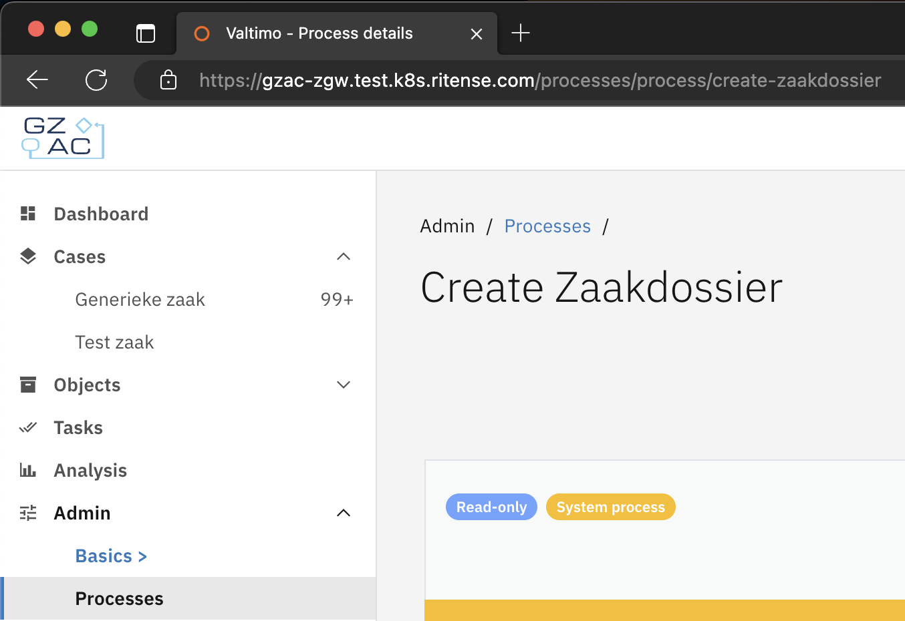

# Breadcrumbs

In [Valtimo front-end libraries version 10.7.0](/release-notes/major10/10.7.0/valtimo-frontend-libraries.md), the existing
page title and breadcrumb components were replaced with Carbon components. Since previously URLs had not been implemented
consistently, a custom solution was made in order to provide breadcrumbs with a good user experience. At the time of
writing, breadcrumbs up to two levels deep are supported.

## Breadcrumbs logic

If a page is at the top level of the page hierarchy, no breadcrumbs are shown, only the page title. This can be seen on
the `/tasks` page:



If a page is at the top level of the page hierarchy, but under a menu category, the menu category is shown as a greyed-ouy
breadcrumb. This can be seen on administrator pages:


One level deeper, the previous page is shown as a breadcrumb after the menu category breadcrumb:



## Custom page title

As can be seen in the previous screenshot, the page title is 'Process details' (visible in the browser tab), but the
page title shown after the last breadcrumb is the name of the entity: 'Create Zaakdossier'. This scenario will be common
in any implementation. 

Since names of entities will likely be retrieved from an API, on page load a skeleton animation is shown, before the
name is loaded. To enable this, add the route data property `customPageTitle` to the route like in the following example:

#### **`process-management-routing.ts`**
  ```typescript
...

const routes: Routes = [
    ...
        path: 'processes/process/:key',
        component: ProcessManagementBuilderComponent,
        canActivate: [AuthGuardService],
        data: {title: 'Process details', roles: [ROLE_ADMIN], customPageTitle: true},
    },
];

...
  ```

Next, set the page title in the component once it is loaded, through the page title service:

#### **`process-management-builder.component.ts`**
  ```typescript
...
import {... PageTitleService} from '@valtimo/components';
...

@Component({
    selector: 'valtimo-process-management-builder',
    templateUrl: './process-management-builder.component.html',
    styleUrls: ['./process-management-builder.component.scss'],
    encapsulation: ViewEncapsulation.None,
})
export class ProcessManagementBuilderComponent implements OnInit, OnDestroy {
    ...
    
    constructor(
        ...
        private readonly pageTitleService: PageTitleService
    ) {}

    ...

    loadProcessVersions(processDefinitionKey: string) {
        this.processService
            .getProcessDefinitionVersions(processDefinitionKey)
            .subscribe((processDefinitionVersions: ProcessDefinition[]) => {
                ...
                this.pageTitleService.setCustomPageTitle(
                    processDefinitionVersions[processDefinitionVersions.length - 1].name
                );
                ...
            });
    }
}

...
  ```

## Hide page title

In some scenario's, it is desirable to show the breadcrumbs, but not the page title. To enable this, add the
property `hidePageTitle` to your route data:

#### **`process-management-routing.ts`**
  ```typescript
...

const routes: Routes = [
    ...
        path: 'processes/process/:key',
        component: ProcessManagementBuilderComponent,
        canActivate: [AuthGuardService],
        data: {title: 'Process details', roles: [ROLE_ADMIN], hidePageTitle: true},
    },
];

...
  ```

## Custom second breadcrumb

By default, when going two pages deep, the second breadcrumb shown is constructed from the URL. On some pages, this logic
will not lead to a correct second breadcrumb. In these cases, it is possible to manually set a second breadcrumb from
the component. This mechanism was used on the case detail page, where the second breadcrumb is meant to refer back to
the list of cases of the selected case type:


In order to manually set the second breadcrumb, follow the below example:

#### **`dossier-detail.component.ts`**
  ```typescript
...

import {BreadcrumbService ...} from '@valtimo/components';

...

@Component({
    selector: 'valtimo-dossier-detail',
    templateUrl: './dossier-detail.component.html',
    styleUrls: ['./dossier-detail.component.css'],
})
export class DossierDetailComponent implements OnInit, OnDestroy {
    ...

    constructor(
        ...
        private readonly breadcrumbService: BreadcrumbService,
        ...
    ) {
        ...
    }

    ngOnInit(): void {
        ...
        this.documentService
            .getDocumentDefinition(this.documentDefinitionName)
            .subscribe(definition => {
                ...
                this.setBreadcrumb();
            });
        ...
    }
    
    ...

    private setBreadcrumb(): void {
        this.breadcrumbService.setSecondBreadcrumb({
            route: [`/dossiers/${this.documentDefinitionName}`],
            content: this.documentDefinitionNameTitle,
            href: `/dossiers/${this.documentDefinitionName}`,
        });
    }
}
  ```

## Retaining query parameters

When clicking a breadcrumb, the user essentially goes a step back, and they want to restore the state of the page they
were on. Therefore, it might be necessary to restore the query parameters used on this page. A mechanism has been
implemented to enable this functionality. 

Before navigating away from the page with the query parameters to be stored, cache the query parameters through the
breadcrumb service, where the first parameter of the method `cacheQueryParams` has to match the route of the breadcrumb
which must restore the query parameters when it is clicked:

#### **`dossier-list.component.ts`**
  ```typescript
...

import {BreadcrumbService ...} from '@valtimo/components';

...

@Component({
    selector: 'valtimo-dossier-list',
    templateUrl: './dossier-list.component.html',
    styleUrls: ['./dossier-list.component.css'],
    providers: [
        ...
    ],
})
export class DossierListComponent implements OnInit, OnDestroy {
    ...
    
    // method used to navigate away from the page
    rowClick(document: any): void {
        this.listService.documentDefinitionName$.pipe(take(1)).subscribe(documentDefinitionName => {
            this.breadcrumbService.cacheQueryParams(
                // after navigating away, a breadcrumb will be shown with a route which matches the string below
                `/dossiers/${documentDefinitionName}`,
                this.route.snapshot.queryParams
            );
            this.router.navigate([
                `/dossiers/${documentDefinitionName}/document/${document.id}/${DefaultTabs.summary}`,
            ]);
        });
    }
    
    ...
}
  ```
