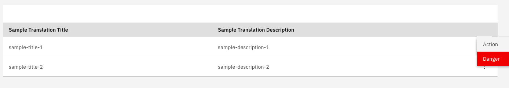

## Setting up a list with actions

Through the `fields` input, actions per row can be set up, in the form of a context menu:

#### **`sample.component.ts`**

```typescript
...
import {ColumnConfig, ViewType} from '@valtimo/components';
...

export class SampleComponent {
 ...
 public fields: Array<ColumnConfig> = [
   {
     viewType: ViewType.TEXT,
     key: 'title',
     label: 'sample.translation.title',
   },
   {
     viewType: ViewType.TEXT,
     key: 'description',
     label: 'sample.translation.description',
   },
   {
   // The callbacks will always receive as a parameter the item in the row
   actions: [
     {
       label: 'sample.action',
       callback: this.action.bind(this),
       type: 'normal',
     },
     {
       label: 'sample.dangerAction',
       callback: this.dangerAction.bind(this),
       type: 'danger',
     },
   ],
   // ViewType ACTION let's us know this is a context menu column
   viewType: ViewType.ACTION,
   // We set up the label as empty because we don't want any header text for the context menu
   label: '',
   // Key is set up as empty because the context menu is not dependant on any item property
   key: '',
 },
 ];
 ...

 public action(item: any): void {
  ...
  // Code for action to do on the item
  ...
 }

 public dangerAction(item: any): void {
  ...
  // Code for action to do on the item
  ...
 }
 ...
}
```

This will create a list with a context menu:

