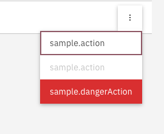

## Setting up a list with actions

Through the `fields` input, actions per row can be set up, in the form of a context menu:

#### **`sample.component.ts`**

```typescript
...
import {ColumnConfig, ViewType} from '@valtimo/components';
...

export class SampleComponent {
 ...
 public fields: Array<ColumnConfig> = [
   {
     viewType: ViewType.TEXT,
     key: 'title',
     label: 'sample.translation.title',
   },
   {
     viewType: ViewType.TEXT,
     key: 'description',
     label: 'sample.translation.description',
   },
 ];
  public actionItems: ActionItem[] =
   // The callbacks will always receive as a parameter the item in the row
   [
     {
       label: 'sample.action',
       callback: this.action.bind(this),
       type: 'normal',
     },
      {
       label: 'sample.action',
       callback: this.action.bind(this),
       // disabledCallback is an optional field that can be added if certain actions are not always available
       disabledCallback: this.disable.bind(this),
       type: 'normal',
     },
     {
       label: 'sample.dangerAction',
       callback: this.dangerAction.bind(this),
       type: 'danger',
     },
   ],
 ...

 public action(item: any): void {
  ...
  // Code for action to do on the item
  ...
 }

 public disabledCallback(item: any): boolean {
  ...
  // Code to check if action item should be disabled
  ...
 }

 public dangerAction(item: any): void {
  ...
  // Code for action to do on the item
  ...
 }
 ...
}
```

This will create a list with a context menu:


Example of actions menu with a disabled item:

