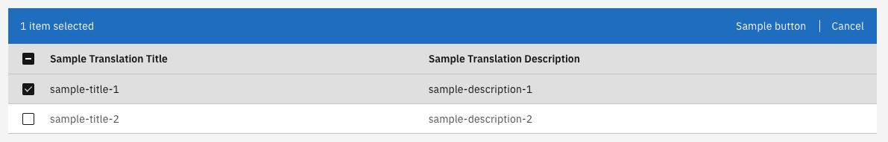

## Multi select List:

The CarbonListComponent supports a multi-select feature. To enable this the following steps must be followed:

1. Set the input in the template:

   #### **`sample.component.html`**

   ```angular2html
   <valtimo-carbon-list
   [items]="items"
   [fields]="fields"
   [showSelectionColumn]="true"
   > </valtimo-carbon-list>
   ```

2. Set the buttons for your multi-select actions:

   #### **`sample.component.html`**

   ```angular2html
   <valtimo-carbon-list
   [items]="items"
   [fields]="fields"
   [showSelectionColumn]="true"
   >
    <ng-container carbonToolbarActions>
      <button cdsButton="primary" (click)="sampleAction()">
        Sample button
      </button>
    </ng-container>
   </valtimo-carbon-list>
   ```

3. Add handler for action:

   #### **`sample.component.ts`**

   ```typescript
   ...
   import {CarbonListComponent} from '@valtimo/components';
   ...
   export class SampleComponent {
    ...
    // We need access to the carbonListComponent in order to get the selected items.

    @ViewChild(CarbonListComponent) carbonListComponent: CarbonListComponent<any>;

    ...
    public sampleAction(): void {
        const selectedItems = this.carbonList.selectedItems;
        // Code to process selected items
    }
    ...
   }
   ...
   ```

This will create a list with multi-select enabled:


