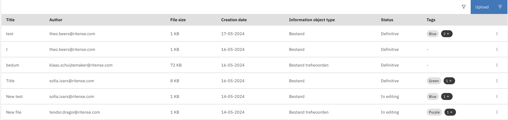

## List with tags

The CarbonListComponent supports rendering tags within its data rows. Tags can be typed, changing their color. The TagType type is defined in the Carbon library.
To enable this the following steps must be followed:

1. Add ViewType.TAGS to the column config:

    #### **`sample.component.ts`**

    ```typescript
    ...
    import {ColumnConfig, ViewType, CarbonListItem} from '@valtimo/components';
    ...

    // For custom templates, the fields need to be set after the view was initialized
    export class SampleComponent {
    ...
    public fields: Array<ColumnConfig> = [
        {
          viewType: ViewType.TAGS,
          key: 'title',
          label: 'sample.translation.title',
        },
        {
            viewType: ViewType.TAGS,
            template: this.sampleTemplate,
            key: 'tags',
            label: 'Tags',
        },
      ];

    //
    public items: Array<CarbonListItem> = [
      {
        title: 'Title 1',
        tags: [
          {
            content: 'tag1',
            type: 'purple'
          },
          {
            content: 'tag2',
            type: 'red'
          },
        ]
      }
    ]
    ...
    }
    ```

2. Add handler for action:

   #### **`sample.component.html`**

   ```angular2html

   <valtimo-carbon-list
       [items]="items"
       [fields]="fields"
   ></valtimo-carbon-list>
   ...
   ```

This will create a list with tags in a row:


