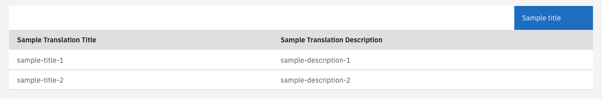

## Toolbar actions list

The CarbonListComponent supports rendering actions in its header. To enable this the following steps must be followed:

1. Add actions in the template:

   #### **`sample.component.html`**

   ```angular2html
   <valtimo-carbon-list
   [items]="items"
   [fields]="fields"
   >
    <ng-container carbonToolbarContent>
      <button cdsButton="primary" (click)="sampleAction()">
        Sample title
      </button>
    </ng-container>

   </valtimo-carbon-list>
   ```

2. Add handler for action:

   #### **`sample.component.ts`**

   ```typescript
   ...
   public sampleAction(): void {
      // Code to process action
   }
   ...
   ```

This will create a list with toolbar actions:

