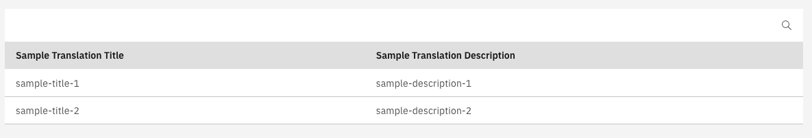

## Searchable list

The CarbonListComponent supports both backend and frontend search. For the frontend search to work, the table must not be paginated. In order to enable search the following steps must be followed:

1. Set the input in the template:

   #### **`sample.component.html`**

   ```angular2html
   <valtimo-carbon-list
       [items]="items"
       [fields]="fields"
       [isSearchable]="true"
   ></valtimo-carbon-list>
   ```

2. (For BE search) Add a listener for the search:

   #### **`sample.component.html`**

   ```angular2html
   <valtimo-carbon-list
     [items]="items"
     [fields]="fields"
     [isSearchable]="true"
     (search)="onSearch($event)"
   ></valtimo-carbon-list>
   ```

3. (For BE search) Define your search handler:

   #### **`sample.component.ts`**

   ```typescript
   ...
   public onSearch(searchString: string) {
       // Code to process search
   }
   ...
   ```

This will create a list with search enabled:


