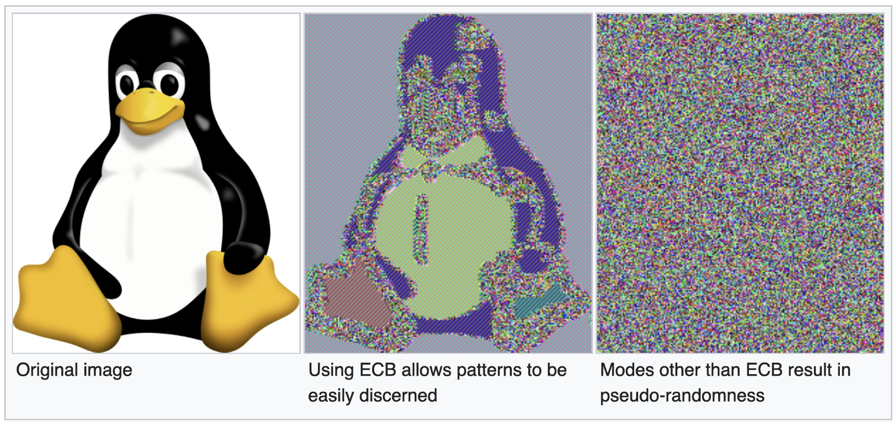

# Valtimo backend libraries

## New Features

The following features were added:

*   **Policy Based Access Control (PBAC)**

    Valtimo now supports Policy Based Access Control (PBAC), which provides detailed authorization checks on actions and data. More information can be found here:

    * [Introduction](../../../fundamentals/architectural-overview/modules.md#authorization)
    * [Getting started](../../../fundamentals/getting-started/modules/core/authorization.md)
    * [Using Valtimo](../../../features/access-control/)

    In order to use Valtimo, permissions and roles must be defined as described [here](../../../features/access-control/).
*   **New service ObjectManagementFacade, for access to ObjectenAPI and ObjecttypenAPI**

    A new service `ObjectManagementFacade` has been added to module `zgw/object-management`. This service allows implementations to make calls to ObjectsAPI without needing to explicitly initialize the plugin configurations for every single use.
*   **Changed encryption algorithm mode**

    The block cypher algorithm used was previously set to use ECB (Electronic Codebook) instead of GCM (Galois Counter Mode). As a result, this means, as long as the key does not change, encrypting plaintext blocks will always result in the same ciphertext block. This matters mainly for larger pieces of text (or images) where patterns can be recognized and some information can be derived. For example, see this image:

    

    Since encryption in Valtimo is applied to keys in valtimo, these are generally a lot shorter, and deriving any kind of information becomes more difficult as a result.
*   **Plugin export API endpoint**

    It is now possible to export the plugin configurations through a REST API endpoint.
*   **Process links export API endpoint**

    It is now possible to export the process link configurations through a REST API endpoint.

## Bugfixes

The following bugs were fixed:

*   **RESTEASY004687 warnings**

    The logs will no longer show the warning message 'RESTEASY004687'. This warning happened because a REST client wasn't closed properly. This has been solved now.
*   **Unable to save choice field values in PostgreSQL**

    Saving choice field values to a PostgreSQL database would fail because a property was only compatible with MySQL and not PostgreSQL. The datatype has been modified, so choice field values can now be saved in PostgreSQL databases.

## Breaking changes

The following breaking changes were introduced:

*   **Removed REST endpoints**

    Several endpoints were meant for public use. By default, Valtimo should not offer any public endpoints, and as a result these have been removed. This is the list of removed endpoints:

    * `/api/v1/public/process/definition/{processDefinitionKey}/start-form`
    * `/api/v1/public/process/definition/{processDefinitionKey}/{businessKey}/start`
    * `/api/v1/public/task/{taskDefinitionId}/resource/pre-signed-url/{fileName}`
    * `/api/v1/public/task/{taskDefinitionId}/resource/{resourceId}`
    * `GET /api/v1/document-definition/{name}/roles`
    * `PUT /api/v1/document-definition/{name}/roles`
    * `GET /api/v1/document-definition?filteredOnRole=false`
      * Has been replaced by `GET /api/management/v1/document-definition`
*   **Removed classes**

    Several classes have been removed in favor of PBAC policies:

    * JsonSchemaDocumentDefintionRole
    * JsonSchemaDocumentDefintionRoleId
*   **Spring bean whitelisting for Camunda**

    Spring beans that are used inside Camunda BPMN's and DMN's must now be whitelisted before they can be used. This can be done using the `@ProcessBean` annotation. More information [here](../../../features/process/process/whitelist-spring-bean.md).
*   **Property 'valtimo.jwt.secret' renamed**

    The application property `valtimo.jwt.secret` has been renamed to `valtimo.oauth.public-key`. To better describe what this property is used for.

    As a consequence of this change, the environment variable `VALTIMO_JWT_SECRET` has been renamed to `VALTIMO_OAUTH_PUBLIC_KEY`.
*   **Property 'valtimo.jwt.tokenValidityInSeconds' renamed**

    The application property `valtimo.jwt.tokenValidityInSeconds` has been renamed to `valtimo.oauth.tokenValidityInSeconds`. To better describe what this property is used for.

    As a consequence of this change, the environment variable `VALTIMO_JWT_TOKEN_VALIDITY_IN_SECONDS` has been renamed to `VALTIMO_OAUTH_TOKEN_VALIDITY_IN_SECONDS`.
*   **Classpath scanning**

    A package whitelist has been added to the classpath scanning. Classpath scanning is used when searching for custom plugins or dashboard data-sources. Custom plugins or dashboard data-sources will not be found when the package name is not whitelisted. By default, only the Valtimo core packages `(com.ritense.valtimo)` and the package of the Spring application's main class are scanned. To scan additional packages for custom plugins or data-sources, the following Spring property should be configured:

    `valtimo.annotation-scan.accepted-packages: test.package1, test.package2`
*   **Deleted 'Authority' entities**

    Valtimo has switched to a new policy based access control system. As a consequence, the old authorities have been removed. The following entities can no longer be used:

    * Database table: 'jhi\_authority'
    * Spring events: AuthorityCreatedEvent, AuthorityDeletedEvent, AuthorityEvent, AuthorityNameChangedEvent
    * Spring beans: AuthorityResource, AuthorityService, AuthorityRepository
    * Domain: Authority, AuthorityRequest, Money
*   **Deleted 'Context' entities**

    Valtimo no longer supports 'contexts'. The following entities can no longer be used:

    * Database table: 'context\_processes', 'context\_roles', 'menu\_item', 'context'
    * Spring beans: ContextResource, ContextService, ContextRepository, UserContextRepository
    * Domain: UserContextDTO, Context, ContextProcess, MenuItem, UserContext
*   **Moved Verzoek plugin property `objectManagementId`**

    For the Verzoek plugin configuration, the property `objectManagementId` has been moved to a deeper level. This change can break any auto-deployment field that contains a Verzoek plugin.
*   **Deleted method from ProcessLinkService**

    `ProcessLinkService.getProcessLinks(activityId, activityType, processLinkType)` was only used for testing.
*   **Renamed methods on CamundaTaskService**

    `CamundaTaskService.completeTaskWithoutFormData(taskId)` -> `CamundaTaskService.complete(taskId)` `CamundaTaskService.completeTask(taskId)` -> `CamundaTaskService.completeTaskWithFormData(taskId)`
*   **Return type changed for CamundaTaskService.findTaskById()**

    `org.camunda.bpm.engine.task.Task` -> `com.ritense.valtimo.camunda.domain.CamundaTask`
*   **Updated Spring Boot**

    Spring Boot has been updated to version 2.7.18

Instructions on how to migrate to this version of Valtimo can be found [here](migration.md).

## Deprecations

The following was deprecated:

*   **Renamed form-flow endpoints**

    Several REST API endpoints for form-flow have been given a new path. The old paths are still functioning but have been deprecated. The following changes have been made:

    * `GET /api/v1/process-link/form-flow-definition` has been replaced with `GET /api/v1/form-flow/definition`
    * `GET /api/v1/form-flow/{formFlowInstanceId}` has been replaced by `GET /api/v1/form-flow/instance/{id}`
    * `POST /api/v1/form-flow/{formFlowId}/step/{stepInstanceId}` has been replaced by `POST /api/v1/form-flow/instance/{id}/step/instance/{id}`
    * `POST /api/v1/form-flow/{formFlowId}/back` has been replaced by `POST /api/v1/form-flow/instance/{id}/back`
    * `POST /api/v1/form-flow/{formFlowId}/save` has been replaced by `POST /api/v1/form-flow/instance/{id}/save`
*   **Renamed case endpoints**

    Several REST API endpoints for cases have been given a new path. The old paths are still functioning but have been deprecated. The following changes have been made:

    * `PATCH /api/v1/case/{caseDefinitionName}/settings` has been replaced with `PATCH /api/management/v1/case/{caseDefinitionName}/settings`
    * `POST /api/v1/case/{caseDefinitionName}/list-column` has been replaced with `POST /api/management/v1/case/{caseDefinitionName}/list-column`
    * `PUT /api/v1/case/{caseDefinitionName}/list-column` has been replaced with `PUT /api/management/v1/case/{caseDefinitionName}/list-column`
    * `DELETE /api/v1/case/{caseDefinitionName}/list-column/{columnKey}` has been replaced with `DELETE /api/management/v1/case/{caseDefinitionName}/list-column/{columnKey}`

Instructions on how to migrate to this version of Valtimo can be found [here](migration.md).

## Known issues

* **Roles assigned via groups in Keycloak are not fully supported** Functionality where the Keycloak API is used to retrieve user data will not be able to use roles assigned via groups. Any functionality that relies on the JWT token will work as expected.
