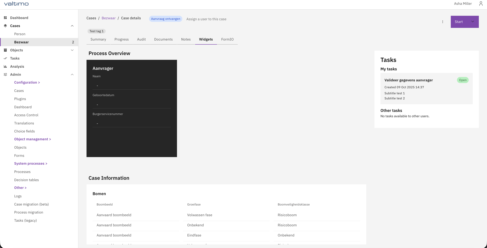

# 13.4.0

## New Features

* The Catalogi API plugin has been expanded with support for two additional methods
  * Get Resultaattypen. Retrieves a list of resultaattypen and saves these in a process variable.
  * Get statustypen. Retrieves a list of statustypen and saves these in a process variable.

* Allow grouping of widgets
A new widget type called Divider has been introduced, enabling grouping of widgets within a case.
The Divider widget type introduces the ability to organize widgets into multiple grid sections.
Optionally, it can display a title, which acts as a header for that widget group.

<figure><figcaption></figcaption></figure>
