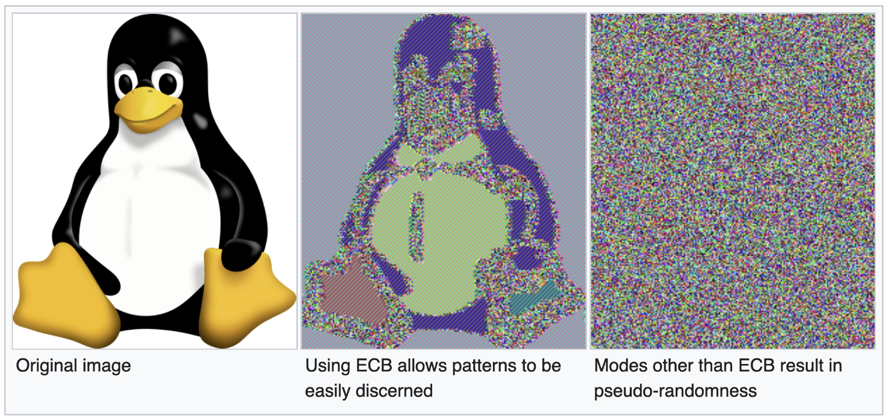

# Backend libraries 11.0.0

## New Features

The following features were added:

* **Policy Based Access Control (PBAC)**

  Valtimo now supports Policy Based Access Control (PBAC), which provides detailed authorization checks on actions and data.
  More information can be found here:
  * [Introduction](/introduction/modules/modules.md#authorization)
  * [Getting started](/getting-started/modules/core/authorization.md)
  * [Using Valtimo](/using-valtimo/access-control/access-control.md)

* **New service ObjectManagementFacade, for access to ObjectenAPI and ObjecttypenAPI**

  A new service `ObjectManagementFacade` has been added to module `zgw/object-management`. 
  This service allows implementations to make calls to ObjectsAPI without needing to explicitly initialize the plugin
  configurations for every single use.

* **Changed encryption algorithm mode**

  The block cypher algorithm used was previously set to use ECB (Electronic Codebook) instead of GCM (Galois Counter Mode). As a result, this means, as long as the key
  does not change, encrypting plaintext blocks will always result in the same ciphertext block. This matters mainly for
  larger pieces of text (or images) where patterns can be recognized and some information can be derived. For example,
  see this image:

  

  Since encryption in Valtimo is applied to keys in valtimo, these are generally a lot shorter, and deriving any kind of
  information becomes more difficult as a result.

* **Plugin export API endpoint**

  It is now possible to export the plugin configurations through a REST API endpoint.
  
* **Process links export API endpoint**

  It is now possible to export the process link configurations through a REST API endpoint.

## Bugfixes

The following bugs were fixed:

* **RESTEASY004687 warnings**

  The logs will no longer show the warning message 'RESTEASY004687'. This warning happened because a REST client wasn't
  closed properly. This has been solved now.

* **Unable to save choice field values in PostgreSQL**

  Saving choice field values to a PostgreSQL database would fail because a property was only compatible with MySQL and not PostgreSQL. The datatype has been modified, so choice field values can now be saved in PostgreSQL databases.   

## Breaking changes

The following breaking changes were introduced:

* **Removed REST endpoints**
  Several endpoints were meant for public use. By default, Valtimo should not offer any public endpoints,
  and as a result these have been removed. This is the list of removed endpoints:
  * `/api/v1/public/process/definition/{processDefinitionKey}/start-form`
  * `/api/v1/public/process/definition/{processDefinitionKey}/{businessKey}/start`
  * `/api/v1/public/task/{taskDefinitionId}/resource/pre-signed-url/{fileName}`
  * `/api/v1/public/task/{taskDefinitionId}/resource/{resourceId}`
  * `GET /api/v1/document-definition/{name}/roles`
  * `PUT /api/v1/document-definition/{name}/roles`
  * `GET /api/v1/document-definition?filteredOnRole=false`
    * Has been replaced by `GET /api/management/v1/document-definition`

* **Removed classes**
  Several classes have been removed in favor of PBAC policies:
  * JsonSchemaDocumentDefintionRole
  * JsonSchemaDocumentDefintionRoleId

* **Property 'valtimo.jwt.secret' renamed**
  The application property `valtimo.jwt.secret` has been renamed to `valtimo.oauth.public-key`. To better describe what
  this property is used for.

  As a consequence of this change, the environment variable `VALTIMO_JWT_SECRET` has been renamed
  to `VALTIMO_OAUTH_PUBLIC_KEY`.

* **Property 'valtimo.jwt.tokenValidityInSeconds' renamed**
  The application property `valtimo.jwt.tokenValidityInSeconds` has been renamed
  to `valtimo.oauth.tokenValidityInSeconds`. To better describe what this property is used for.

  As a consequence of this change, the environment variable `VALTIMO_JWT_TOKEN_VALIDITY_IN_SECONDS` has been renamed
  to `VALTIMO_OAUTH_TOKEN_VALIDITY_IN_SECONDS`.

* **Classpath scanning**

  A package whitelist has been added to the classpath scanning. Classpath scanning is used when searching for custom plugins or dashboard data-sources.
  Custom plugins or dashboard data-sources will not be found when the package name is not whitelisted. 
  By default, only the Valtimo core packages `(com.ritense.valtimo)` and the package of the Spring application's main class are scanned.
  To scan additional packages for custom plugins or data-sources, the following Spring property should be configured:
  
  `valtimo.annotation-scan.accepted-packages: test.package1, test.package2`

Instructions on how to migrate to this version of Valtimo can be found [here](migration.md).

## Deprecations

The following was deprecated:

* **Deprecation1**

  X was deprecated and is replaced with Y.

* **Deprecation2**

  X was deprecated and is replaced with Y.

Instructions on how to migrate to this version of Valtimo can be found [here](migration.md).

## Known issues

This version has the following known issues:

* **Issue1**
  * Discovered in version x.x.x
  * Describe what can be done to work around the issue

* **Issue2**
  * Discovered in version x.x.x
  * Describe what can be done to work around the issue
