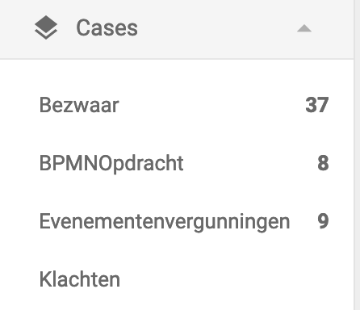

# Frontend libraries 5.15.0 (RC)

## New Features

The following features were added:

* **Override default case list tabs**

  A new (optional) environment property, `visibleDossierListTabs` is introduced to change the visibility of the default tabs in the `valtimo-dossier-list` component.

  The new property is an array that includes the tabs that need to be visible on the page. The collection can consist of the following values: `DossierListTab.MINE`, `DossierListTab.OPEN`, and `DossierListTab.ALL`.

  Only cases assigned to the current user are displayed when the option 'my cases' are selected. When selecting the 'unassigned cases'  tab, only the cases with no assignee set are shown.

  With this new property, you can either hide specific tabs that are visible by default or change their default order.

* **New feature1**

  Description of the new feature goes here.
  Also link to the page that expains the feature in greater detail.

* **Number of open cases now shown in menu**

  The number of open/unassigned cases is now shown in the Valtimo menu. When the number of open cases changes, the
  number in the menu is automatically updated without reloading the page.

  

## Bugfixes

The following bugs were fixed:

* **Bug1**

  Description of what the issue was.

* **Bug2**

  Description of what the issue was.

## Breaking changes

The following breaking changes were introduced:

* **Breaking change1**

* **Breaking change2**

Instructions on how to migrate to this version of Valtimo can be found [here](migration.md).

## Deprecations

The following was deprecated:

* **Deprecation1**

  X was deprecated and is replaced with Y.
* **Deprecation2**

  X was deprecated and is replaced with Y.

Instructions on how to migrate to this version of Valtimo can be found [here](migration.md).

## Known issues

This version has the following known issues:

* **Issue1**
  * Discovered in version x.x.x
  * Describe what can be done to work around the issue

* **Issue2**
  * Discovered in version x.x.x
  * Describe what can be done to work around the issue
