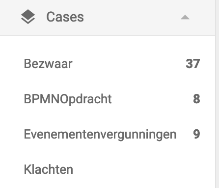

# Valtimo frontend libraries (5.15.0)

## New Features

The following features were added:

*   **Override default case list tabs**

    A new (optional) environment property, `visibleDossierListTabs` is introduced to change the visibility of the default tabs in the `valtimo-dossier-list` component.

    The new property is an array that includes the tabs that need to be visible on the page. The collection can consist of the following values: `DossierListTab.MINE`, `DossierListTab.OPEN`, and `DossierListTab.ALL`.

    Only cases assigned to the current user are displayed when the option 'my cases' are selected. When selecting the 'unassigned cases' tab, only the cases with no assignee set are shown.

    With this new property, you can either hide specific tabs that are visible by default or change their default order.
*   **Case definition setting enables an option to set an assignee to a case on case management**

    Added a new setting on the case management page to indicate that a case type can have an assignee.

    More information on this case setting can be found [here](broken-reference/).
*   **Number of open cases now shown in menu**

    The number of open/unassigned cases is now shown in the Valtimo menu. When the number of open cases changes, the number in the menu is automatically updated without reloading the page.

    
*   **New tab 'list columns' on case management page**

    Added a new separate tab on case management page to configure case list columns.
*   **Disable unassigned case count feature toggle**

    It is now possible to disable showing the number of open cases in the menu. To do this, set `disableCaseCount` under `featureToggles` in the environment file(s) to `true`.
*   **Hide assignee functionality based on the 'can have assignee' setting**

    If the checkbox 'This case type can have a handler' is enabled on the admin page of a case type, the open case count of the case type will display in the right menu. Moreover, on the case list page of this case type the tabs 'All cases', 'My cases', and 'Unassigned cases' will display. Lastly, on the detail page of an instance of this case type, the 'Claim' button and 'Assign a user to this case' dropdown menu will display. If the aforementioned checkbox is unchecked, all of this assignee functionality will not be displayed.

## Bugfixes

The following bugs were fixed:

*   **Total number of cases found in case list**

    In the badge on the case list the total number of items on the page was shown instead of the actual number of cases found based on the search criteria.
*   **Form definition download**

    When downloading a form definition on the form builder page, the metadata of the form definition was included. When uploading the downloaded file, the form definition was not valid. This has been changed so the downloaded file only includes the actual form definition.

## Breaking changes

No breaking changes.

## Deprecations

No new deprecations.

## Known issues

This version has the following known issues:

* **Viewing and editing DMN tables does not work if there is no 'featureToggles' object present in the environment configuration.**
  * Discovered in version 9.26.0
  * As a workaround, an empty 'featureToggles' object can be added to the environment configuration file(s).
