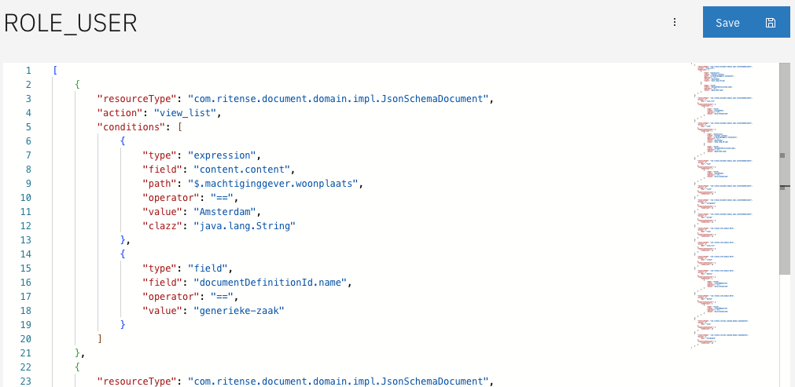
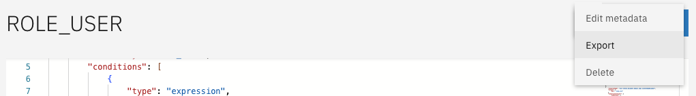

# Configuring permissions

In order to allow users to perform certain actions, permissions have to be set up for a specific role. For information
on how to configure roles, see [this page](configuring-roles.md).

## How to create permissions

Creating permissions is done for a specific role. Assuming a role is present, clicking on that role in the
`Access control` interface will allow permissions to be configured.



The image above shows all the permissions that have been configured for `ROLE_USER`. Here, permissions can be added,
edited and removed. Since the list shown here is the full list of permissions for this role, removing a permission from
the list and saving it will also result in the removal of that permission in Valtimo.

### Permission structure

There are a lot of elements that can be specified for permissions. As an example, someone with `ROLE_USER` can have
access to cases of type `example-document-definition`, or if that someone has been assigned to the case. The following
two permissions are used to define this:

```json
[
    {
        "resourceType": "com.ritense.document.domain.impl.JsonSchemaDocument",
        "action": "view_list",
        "conditions": [
            {
                "type": "field",
                "field": "documentDefinitionId.name",
                "operator": "==",
                "value": "example-document-definition"
            }
        ]
    },
    {
        "resourceType": "com.ritense.document.domain.impl.JsonSchemaDocument",
        "action": "view_list",
        "conditions": [
            {
                "type": "field",
                "field": "assigneeId",
                "operator": "==",
                "value": "${currentUserId}"
            }
        ]
    }
]
```

Going over each element:

* `resourceType` is required to specify what resource type this permission applies to. For information on the resource
  types Valtimo provides out of the box, see [here](/reference/modules/authorization.md). For information on how to
  register custom resource types, see
  [here](/extending-valtimo/access-control/registering-a-resource.md).
* `actionKey` specifies the kind of action that is being done. In this case, viewing a list. For a list of actions, see
  [here](/reference/modules/authorization.md).
* `conditions` is a list describing all the conditions that apply to this particular permission. This requires
  knowledge of the code for the resource type, as fields can be specified in here correspond to fields inside the class.
  For information on the kinds of conditions that can be specified, as well as the fields,
  see [this page](/reference/modules/authorization.md#supported-conditions).
  Permission is only granted when all conditions for that permission are met.

### Exporting permissions

Exporting permissions for a specific role can be done here, or on the [list in bulk](configuring-roles.md#export). When
exporting permissions from the permission configuration page, be sure to save the configurations first if any edits have
been made. Exporting will add a few more fields that are not necessary when configuring permissions via the UI, but are
necessary when doing auto-deployment. For information on auto-deployment,
see [this page](auto-deployment-access-control.md#auto-deployment).



### Deleting permissions

Deleting permissions will also delete the accompanying role. Deleting roles will not delete the role in Keycloak.


## Examples

### Expression permission with contains operator

In the example below, the `contains` operator is used to check if a specific flower is present inside the
JsonSchemaDocument. Where the JsonSchemaDocument content could look like this: `{"flowers": ["lily", "rose", "daisy"]}`.

If the flower 'rose' is present in the JsonSchemaDocument, any user with the role `ROLE_USER` will be able to view that
document.

```json
[
    {
        "resourceType": "com.ritense.document.domain.impl.JsonSchemaDocument",
        "action": "view_list",
        "roleKey": "ROLE_USER",
        "conditions": [
            {
                "type": "expression",
                "field": "content.content",
                "path": "$.flowers",
                "operator": "contains",
                "value": "rose",
                "clazz": "java.util.Collection"
            }
        ]
    }
]
```

### Create case permissions

The following example demonstrates how to allow any user with `ROLE_USER` to create a case of type `leningen`. When 
trying to create a case, the case itself does not yet exist. So in order for conditions  to be evaluated, they have to be
defined based on the relation between the two resources,`JsonSchemaDocument` and `JsonSchemaDocumentDefinition`.

```json
[
    {
        "resourceType": "com.ritense.document.domain.impl.JsonSchemaDocument",
        "action": "create",
        "roleKey": "ROLE_USER",
        "conditions": [
            {
                "type": "container",
                "resourceType": "com.ritense.document.domain.impl.JsonSchemaDocumentDefinition",
                "conditions": [
                    {
                        "type": "field",
                        "field": "id.name",
                        "operator": "==",
                        "value": "leningen"
                    }
                ]
            }
        ]
    }
]
```

### User task candidate groups permissions

Access to a user task is usually controlled by setting the 'Candidate groups' to a role. To make sure that the user task
candidate groups work together with PBAC, an additional permission should be set. The example below shows how that can
be done.

```json
[
    {
        "resourceType": "com.ritense.valtimo.camunda.domain.CamundaTask",
        "action": "view_list",
        "roleKey": "ROLE_USER",
        "conditions": [
            {
                "type": "container",
                "resourceType": "com.ritense.valtimo.camunda.domain.CamundaIdentityLink",
                "conditions": [
                    {
                        "type": "field",
                        "field": "groupId",
                        "operator": "==",
                        "value": "ROLE_USER"
                    }
                ]
            }
        ]
    }
]
```
