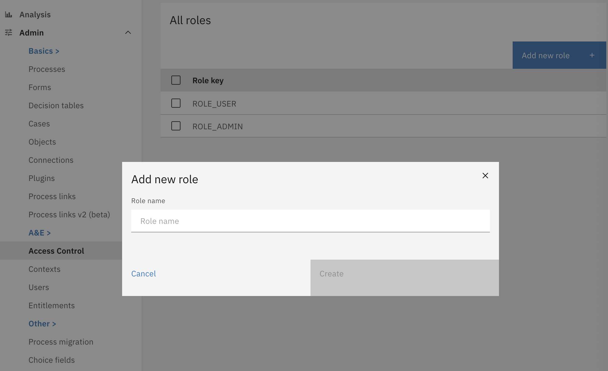
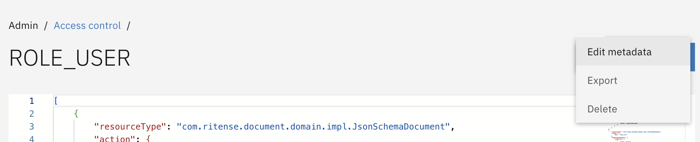
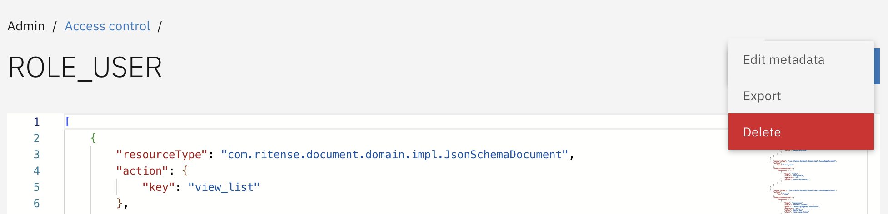
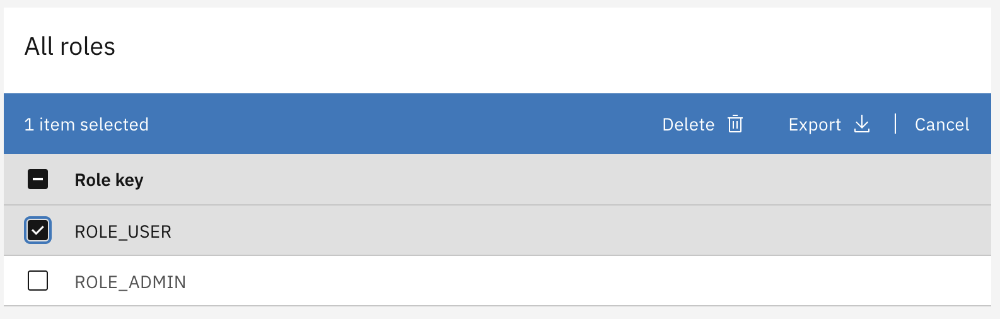
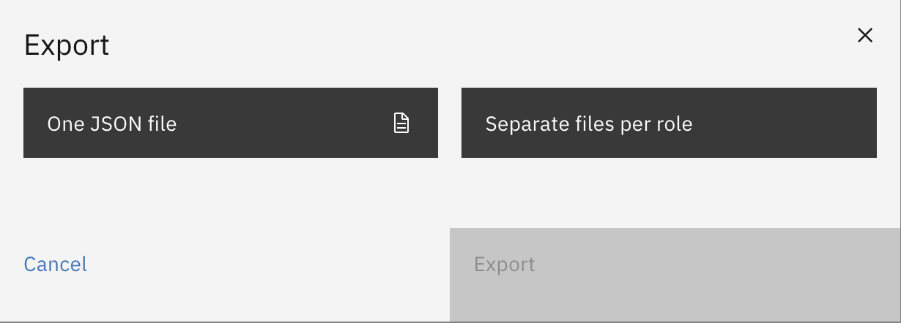
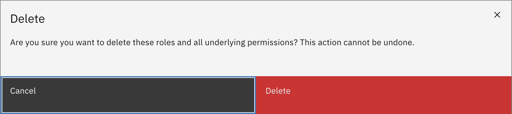

# Configuring roles
In order to allow users to perform certain actions, permissions have to be set up. Before permissions, however,
roles should be created that are also contained in a user JWT token. For example, if a user has `ROLE_USER` in Keycloak.
In order to create permissions that apply to that specific role, the role has to first be known by Valtimo. Keep in mind
`ROLE_ADMIN` will always have access to items in the admin menu.

For information on how to configure permissions, see [this page](configuring-permissions.md).

## Creating a role
Creating a role can be done by going to the `Admin` menu. There, under `A&E` you will find `Access Control`. This will
show the list of roles that have been configured. In order to create a new role, make sure no other roles are selected,
and press `Add new role`. A dialog will show that allows you to specify the name of the role before creating it.

## Editing a role
Roles can be edited by clicking on that role. Then, by clicking on the three dots next to the `Save` button, the role
can then be updated.

## Deleting a role
Roles can be deleted by clicking on that role. Then, by clicking on the three dots next to the `Save` button, the role
can then be deleted.

## Bulk actions for roles
In addition to creating a role, roles can also be deleted, or exported. These options will only show when one or more
roles have been selected.

### Export
Exporting a role not only exports the role itself, but also the configured permissions. This can be used to create or
update auto-deployment files. For information on how auto-deployment works for Access Control, see [here](auto-deployment-access-control.md#auto-deployment).

When exporting roles, there are two options. Either to export all selected roles as one single file, or alternatively 
downloading separate files per role. 

### Delete
Roles can also be deleted. Take caution, as deleting roles will also result in the deletion of related permission.
Deleting roles will not delete the role in Keycloak.

