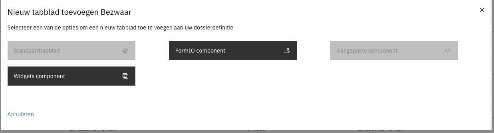
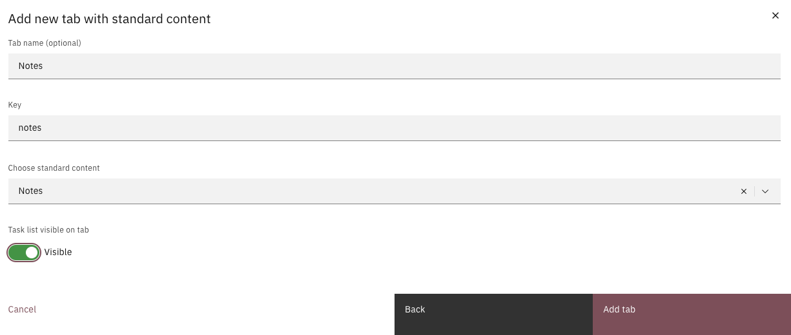

# Case tabs

Case tabs are the tabs that are shown on the case detail page. They are used to break up the information of a case into
logical categories. The tabs that are shown can be configured per case type.


By default, each newly created case type has a number of tabs that are preconfigured. A list of default tabs is available
on the [reference page](/reference/modules/case.md#default-case-tabs).

Case tab can be configured manually using the [Admin UI](#configuration-using-the-admin-menu),
or by using [autodeployment](#auto-deploying-case-tabs).

## Enabling case tabs

To enable case tabs, set the `enableTabManagement` feature toggle to `true` in your front-end implementation. For more
information on this feature toggle, visit [this page](/reference/feature-toggles.md).

## Different types of case tabs

Valtimo supports the following 3 different types of case tab.

### Standard tabs

Valtimo comes with a number of tabs that support different features. These range from showing a summary form, or showing
an audit log to showing the current state of the BPMN process.

The standard tabs that are available are listed on the [reference page](/reference/modules/case.md#standard-tabs).

### Form.io tabs

Form.io tabs are tabs that show a single Form.io form as the tab content. Any Form.io form that has been registered
with valtimo can be chosen. This is purely meant to display information, as there is no way to submit the information
even if a submit button has been added to the form definition.

### Custom tabs

When you want tab with functionality that is not covered by the other tab types you can create a custom Angular
component that is used as a case tab. These Angular components have to be registered in the
Angular application as a potential tab.

#### **`app.module.ts`**

```typescript
...
// import CASE_TAB_TOKEN
import { CASE_TAB_TOKEN } from '@valtimo/dossier';
...
// import your custom component from wherever you have defined it
import {CustomTabComponent} from 'component-path';
...

// add this to the providers array of the AppModule
...
    {
      provide: CASE_TAB_TOKEN,
      useValue: {
        'custom-tab-name': CustomTabComponent,
      },
    }
...
export class AppModule {
    ...
}
```

## Configuration using the Admin menu

The case tab menu is found under the admin menu. Admin privileges are required to configure case tabs.

1. Go to the Admin menu

2. Go to the 'Cases' menu

3. Click on the case for which tabs need to be configured

4. Click on the 'Add tab' button

   

5. Select which tab type you want to configure

   

6. Fill in the form. If no name is set, then the key will be used for translation (in your translation files, add the key under 'dossier.tabs.{YOUR_TAB_KEY}')

   

7. Click the button 'Add tab'

If there are no tabs to be configured for one specific type, then the button in the Step 5 modal will be disabled.


This can occur for one of two reasons:

- You have already configured all possible tabs of a type
- There are no tabs provided for configuration (i.e. no form definitions or no configurations for custom tabs)

## Auto deploying case tabs

Case tabs can be auto-deployed from a JSON file at startup. This is useful to keep the case tab configuration identical
across multiple environments. Case tabs are auto-deployed by scanning files on the classpath that end
in `.case-tab.json`.

### Changesets

Every deployment file for represents a changeset. These files are required to contain a changesetId that should be
unique over all deployment files that use changesets. When starting up, changesets that have already been executed will
be ignored. A checksum of the changeset is created when it is executed. Changesets that have already been deployed
should not change. Changesets that have been changed since a previous time will result in an error and failure to start
the application.

All changesets can be executed again, even when the content has changed, by setting
the `valtimo.changelog.case-tabs.clear-tables` property to `true`.

### Example

You can find an example of the JSON below.

In this example a tab is created with type `standard`. Different tab types can be used to customize the tab. The types
that are available can be found on the [reference page](/reference/modules/case.md#case-tabs-types).

```json
{
  "changesetId": "my-case-definition-name-tabs-v1",
  "case-definitions": [
    {
      "key": "my-case-definition-name",
      "tabs": [
        {
          "name": "Summary",
          "key": "summary",
          "type": "standard",
          "contentKey": "summary"
        },
        {
          "name": "Progress",
          "key": "progress",
          "type": "standard",
          "contentKey": "progress"
        },
        {
          "name": "Zaak objects",
          "key": "zaakobjecten",
          "type": "standard",
          "contentKey": "zaakobjecten"
        }
      ]
    }
  ]
}
```
