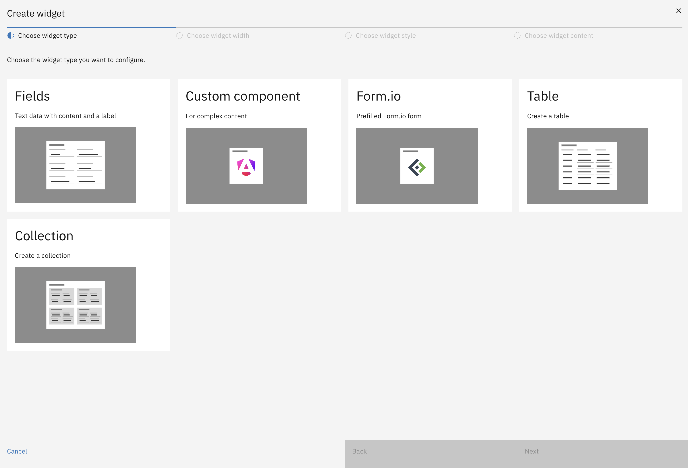
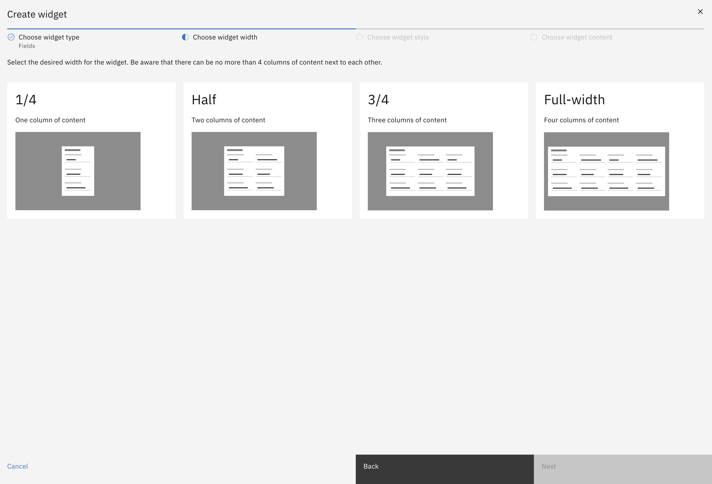
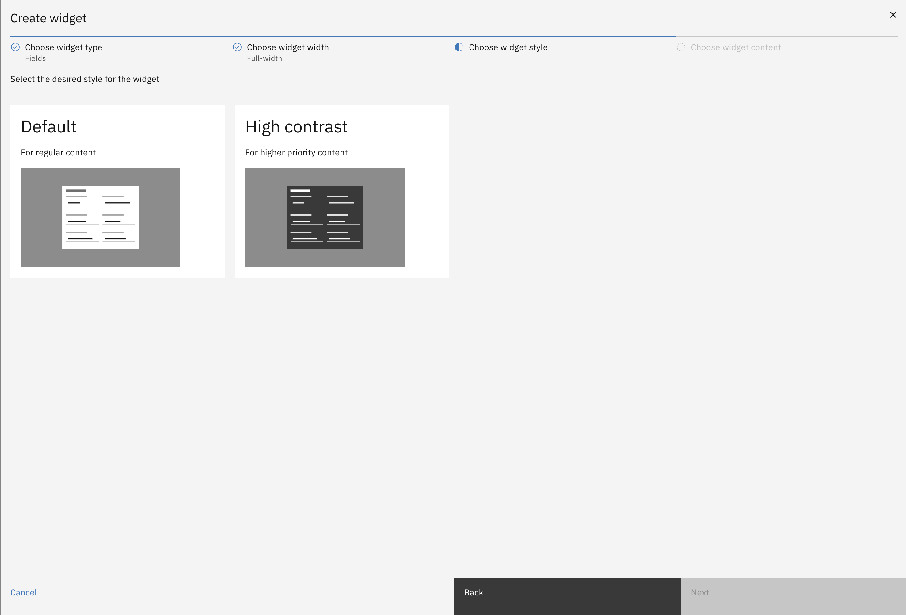
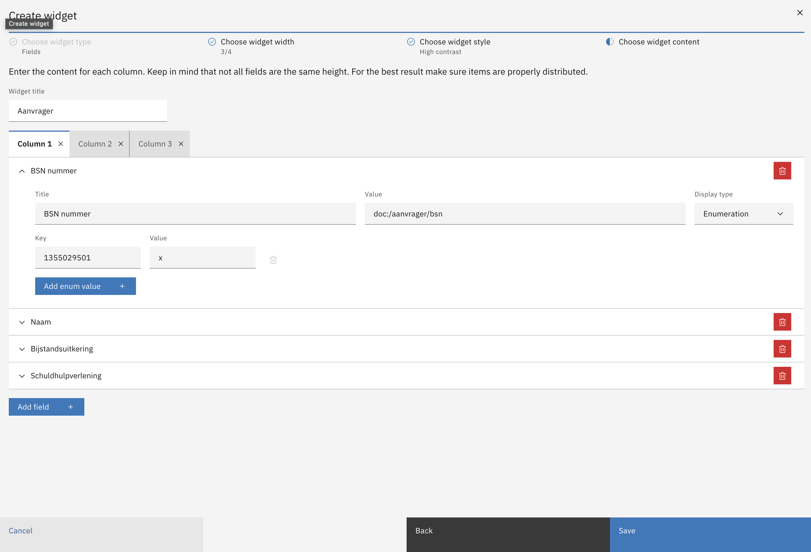

# Configuring a widget

### There are 4 steps to configuring a widget:

1. Choosing the widget type. Out of the box, 5 widget types are supported:: Fields, Custom component, FormIO form, Table, Collection:

   

2. Choosing a widget width. The widget can be configured to display on any number of columns between 1 and 4:

   

3. Choosing a widget style. A widget can either have a Default color scheme or it can be High Contrast for more important widgets:

   

4. Filling in the widget content. Depending on the widget type, the content is filled in differently

   - [Fields widget](./content/fields.md)
   - [Custom component widget](./content//custom.md)
   - [Form.io widget](./content//formio.md)
   - [Table widget](./content/table.md)
   - [Collection widget](./content/collection.md)

   

### JSON editor

The widgets for a case can also be configured via a JSON editor.