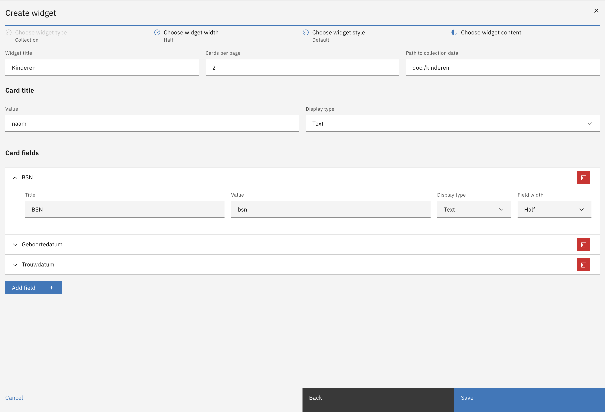

# Filling in Collection content

For the collection, a few fields are obligatory to be filled in:
  - Widget title
  - Number of cards per page
  - Path to the collection data from the Case Definition
  - Card title value (the path to a value in the collection you specified earlier)
  - Card title display type. More about display types can be found [here](../display-types.md)

Under the Card fields you can configure the fields that will be displayed under each card.
More about fields can be found [here](../field.md).
As opposed to a regular field, fields defined in the Collection widget also have an extra property *Width*.
This defines how much of the widget width the field will take up.

