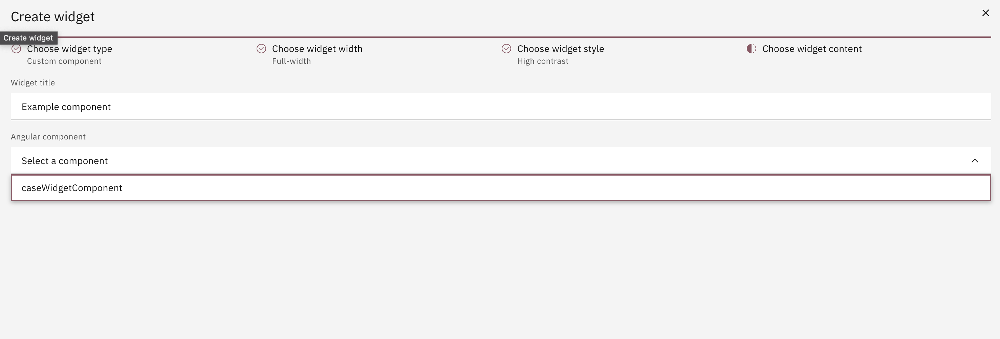

## Custom Component Widget

The custom component widget is meant to display any custom Angular component that you may need.
There is a prerequisite for being able to configure this kind of widget. You need to register your custom component through our injection token available in _@valtimo/dossier_.

In order to do this, to your app.module, you need to add this:

#### **`sample.app.module.ts`**

```typescript
...
import {CUSTOM_CASE_WIDGET_TOKEN} from '@valtimo/dossier';
import {ExampleCustomComponent} from 'custom-component-path';
...
@NgModule({
  ...
  providers:[
  {
   provide: CUSTOM_CASE_WIDGET_TOKEN,
   useValue: {
     caseWidgetComponent: ExampleCustomComponent,
     },
  },
 ]
})
export class SampleAppModule
```

After this is done when configuring your Case Widget, a dropdown will be populated with all registered custom components:


