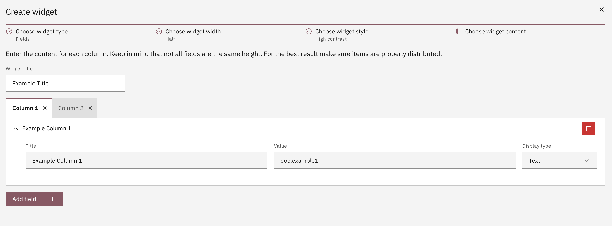

# Fields

For the fields widget the values that need to be configured are:

- Widget title
- Widget fields. More about fields can be found [here](../field.md)

The fields widget is also able to display data on multiple columns. As such a column can be added or removed.
However you cannot have more columns than the width of the widget (i.e. if your widget has a width of _Half_ you cannot add more than 2 columns to it).

