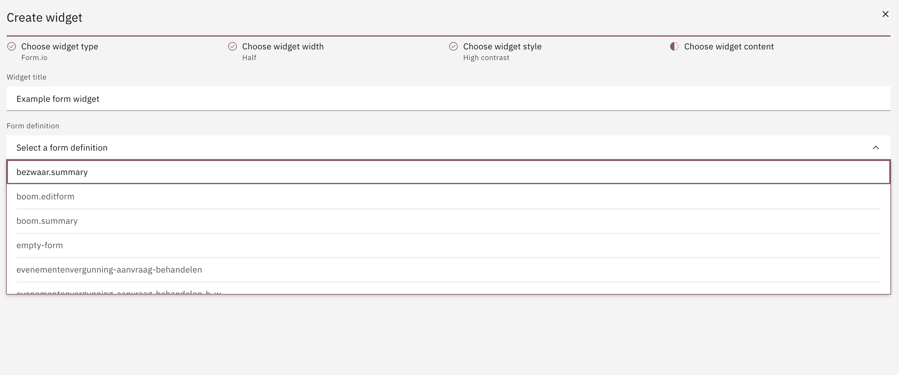

## Form.io

For the Form.io widget there's only two fields that need to be configured:

- Widget title
- Form.io form. For this, the dropdown is populated with all Form Definitions that you have created in your Valtimo instance.



### Color tokens

For the Form.io forms to be properly displayed in both normal and high
contrast widgets, some custom CSS adjustments might be necessary. Form.io 
text should use the Carbon color tokens instead of regular hex values. 
For example: 
```css
color: var(--cds-text-primary)
```