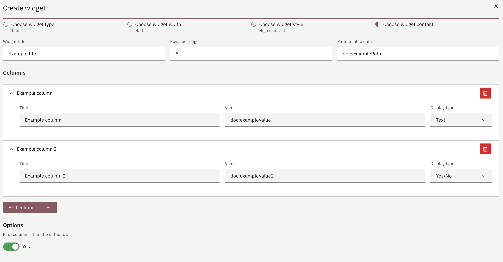

# Table

For the Table widget there's a few fields that need to be configured:

- Widget title
- Rows per page
- Path to table data (the path in your Case Definition that contains the data)
- Columns that the table needs to have. The columns are base on a field configuration. More about fields can be found [here](../field.md)

There's also an optional toggle called _First column is the title of the row_. Enabling this will display the first column with italics and no underline.

