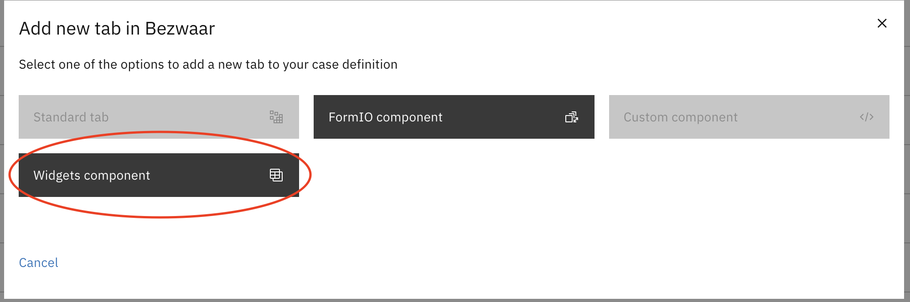
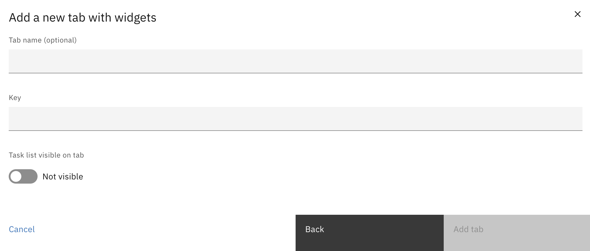

# Creating a case widgets tab

A case widgets tab can be added from the "Tabs" section under Admin > Cases

After selecting the widgets tab, this modal needs to be filled with the key. The title is optional.

