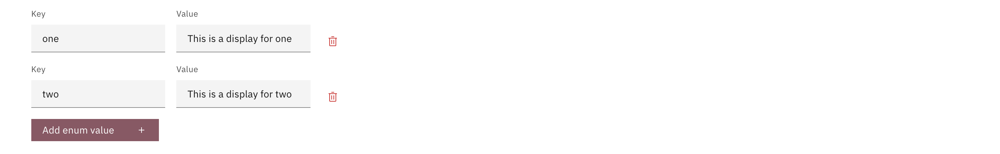

# Display Types

There are several display types supported in the Case Widgets configuration process:

## Text

This is just regular text.

## Yes/No

This converts a boolean value to "Yes"/"No".

## Date

This takes date string. A format can be specified for how you wish the date to be displayed (this is optional).

## Number

The number display type is based on the DecimalPipe from Angular. A format can be specified for how you wish the number to be displayed (this is optional).
More information about the format structure can be found [here](https://v17.angular.io/api/common/DecimalPipe) under the *digitsInfo* section

## Percentage

The percentage display type is based on the PercentPipe from Angular. A format can be specified for how you wish the percentage to be displayed (this is optional).
More information about the format structure can be found [here](https://v17.angular.io/api/common/PercentPipe) under the *digitsInfo* section.
In the context of Valtimo, we by default divide any value under the percentage display by 100, unless a format is specified. This has been done because of the values that the Angular PercentPipe expects.

## Currency

The currency display type is based on the CurrencyPipe from Angular. A format can be specified for how you wish the currency to be displayed (this is optional).
More information about the format structure can be found [here](https://v17.angular.io/api/common/CurrencyPipe) under the *Parameters* section.

## Enum

The enum is meant to assign a value to a key as to display data more accurately.

In the example above, whenever the value "one" is found as a value, the widget will display it as "This is example for one"
