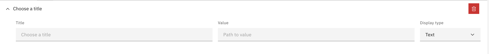

## Field

A field can be configured to display data from a Case in a certain way.

For each widget field there's there obligatory input fields that need to be filled in

- Field title
- Field value (the path to a value in your Case Definition)
- Display type. More about display types cand be found [here](./display-types.md)

