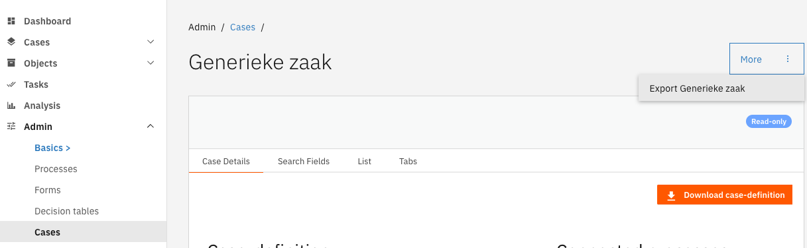
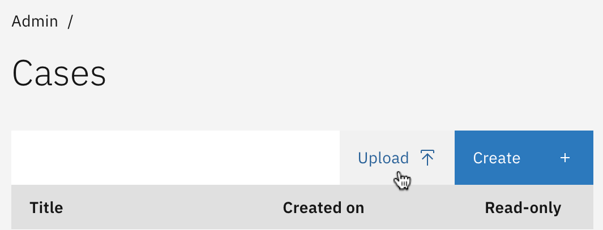

# Exporting and importing case definitions

A case definition is a collection of configurations and definitions, such as the document definition, process
definitions, forms, form flows and process links. These case definitions can be exported as a ZIP archive, so it can
be imported via the UI, added to the repository or shared with others.

## Export

Exporting can be done by navigating to the case definition detail page and pressing the export button (see image below).
This will result in a ZIP archive containing configurations and definitions that make up the case definition. The
structure is the same as found in any application that makes use of the auto-deployment offered by Valtimo.

### Included in the export

The following configurations and definitions are included in the export:
- Case definition settings
- Case search fields
- Decision definitions
- Document definition
- Form flow definitions
- Form definitions (includes case summary if present)
- Internal case statuses
- Case list columns
- Case tabs
- Case tab widgets
- Process definitions
- Process document associations
- Process links
- Task search fields
- Task list columns
- ZGW document columns
- ZGW document trefwoorden

### Excluded from the export

Some related configurations are not exported, as they are not case definition specific. These are:
- Dashboards
- Access control
- Plugin configurations

## Import

Importing can be done by navigating to the case definition list page and pressing the Upload button (see image below).
Follow the wizard and select the exported file (ZIP).

### Included in the import

The following configurations and definitions are included in the import:
- Case definition settings
- Case search fields
- Decision definitions
- Document definition
- Form flow definitions
- Form definitions (includes case summary if present)
- Internal case statuses
- Case list columns
- Case tabs
- Case tab widgets
- Process definitions
- Process document associations
- Process links
- Task search fields
- Task list columns
- ZGW document columns
- ZGW document trefwoorden

### Excluded from the import

Some related configurations are not imported, as they are not case definition specific. These are:
- Dashboards
- Access control
- Plugin configurations
