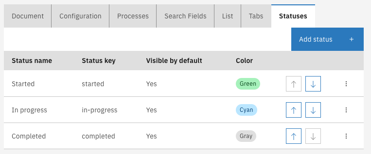
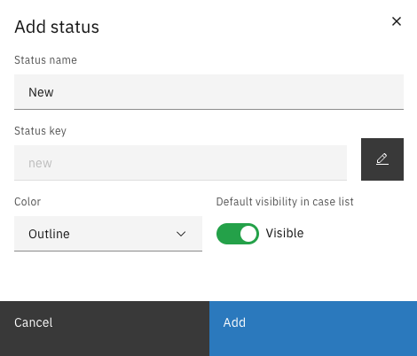
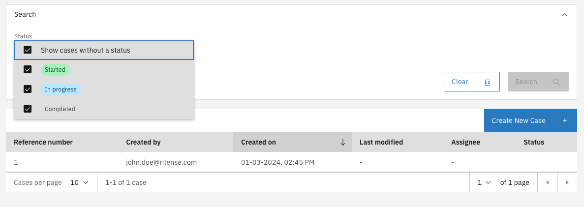
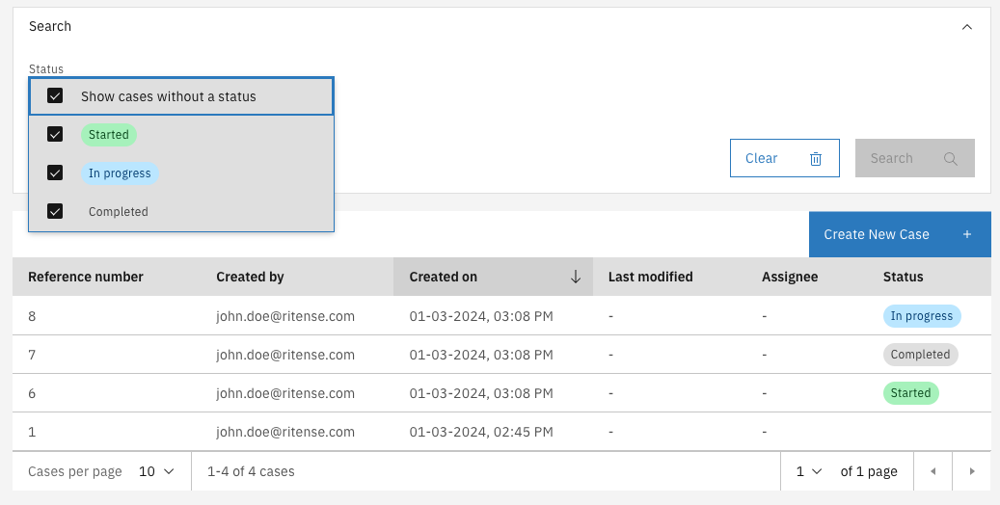
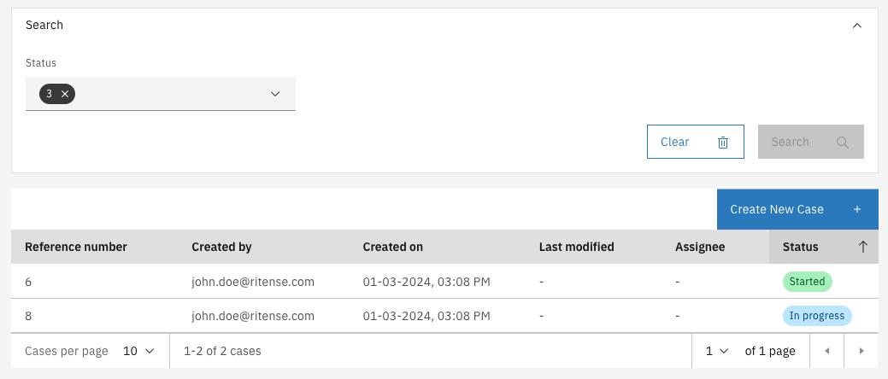

# Internal case status

An internal case status (status from here on), is a case property which defines what the current state or status is.
The status is called 'internal', because by default it is not related to any status beyond the scope of Valtimo / GZAC (though implementations are not
restricted to use it for that purpose).

## Configuring statuses
Statuses can be configured in the Case admin screen, at the 'Statuses' tab:


### Adding a status
A status can be added by clicking on the [Add status] button on the screen. A form will be shown where you can enter some values:


**Field explanation**

- Name: used as a label in the case summary and list
- Key: the technical identifier of that status
- Color: used for the label/tags of a status. The following colors are available:
  - Red (`RED`)
  - Magenta (`MAGENTA`)
  - Purple (`PURPLE`)
  - Blue (`BLUE`)
  - Teal (`TEAL`)
  - Green (`GREEN`)
  - Cyan (`CYAN`)
  - Gray (`GRAY`)
  - Cool gray (`COOLGRAY`)
  - Warm gray (`WARMGRAY`)
  - High contrast (`HIGHCONTRAST`)
  - Outline (`OUTLINE`)
- Visible: If enabled, the status is included in the case search filter by default. When disabled, the user has to manually enable it in the filter so see any
  results with that status.

### Autodeployment
Status configurations can be autodeployed by creating json files in the `classpath*:config/` folder. The name of the file has to end with `.internal-case-status.json`.
You can find an example of the JSON below:

`example.internal-case-status`:
```json
{
  "changesetId": "example.internal-case-status.1709304109619",
  "internalCaseStatuses": [
    {
      "key": "started",
      "caseDefinitionName": "example",
      "title": "Started",
      "visibleInCaseListByDefault": true,
      "color": "GREEN"
    },
    {
      "key": "in-progress",
      "caseDefinitionName": "example",
      "title": "In progress",
      "visibleInCaseListByDefault": true,
      "color": "CYAN"
    },
    {
      "key": "completed",
      "caseDefinitionName": "example",
      "title": "Completed",
      "visibleInCaseListByDefault": false,
      "color": "GRAY"
    }
  ]
}
```

### Import and export
The configuration is also included when importing or exporting a case. It uses the same format as the [autodeployment](#autodeployment).

### Ordering

Statuses can be ordered, which will be used for the following:

- Order of statuses in the admin screen
- Order of statuses in the filter dropdown
- Sorting of cases by status

## Using statuses
Now that the statuses have been configured, not much has changed yet for the user. A filter and a status column is now visible to the user, but it does not add
any value yet since no statuses are set to the cases:


### Setting a status to a case
To make sure statuses are updated during the process, a task expression can be added to any task where you want the status to change:
`${documentDelegateService.setInternalStatus(execution, 'new')}`

### Filtering cases
Now that the process sets the correct statuses to the case, it can be used to filter and sort cases:





