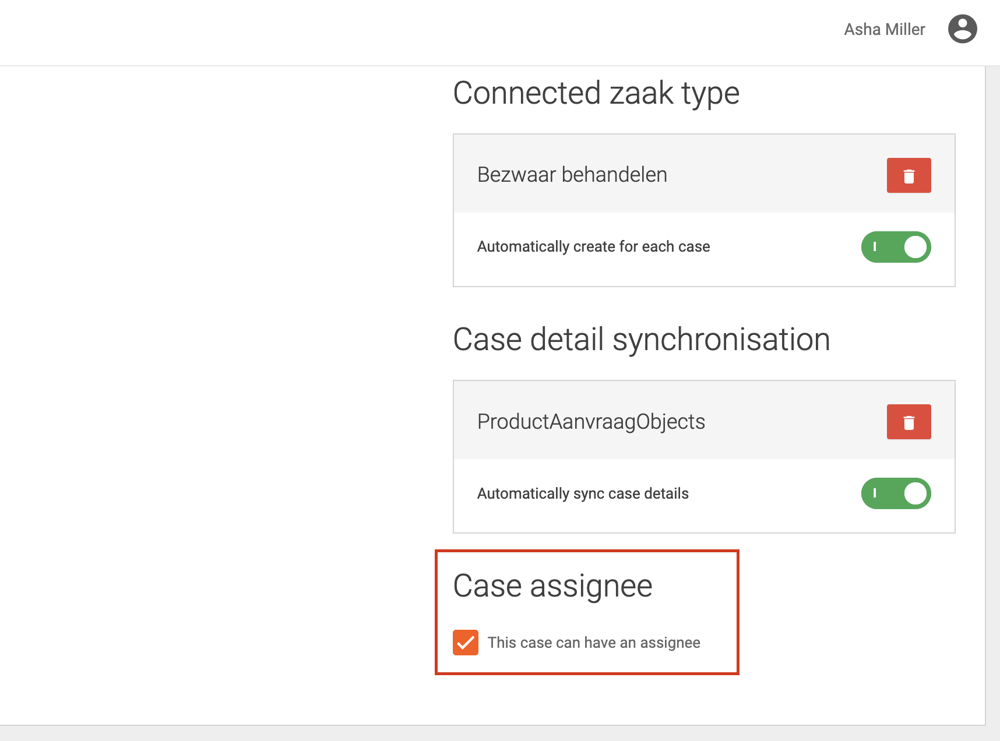

# How to enable cases to be assignable

On the case management page, a setting can be changed to indicate that cases of that type can have an assignee (checkbox).

On this page you can check the Case assignee checkbox to enable assigning cases.

