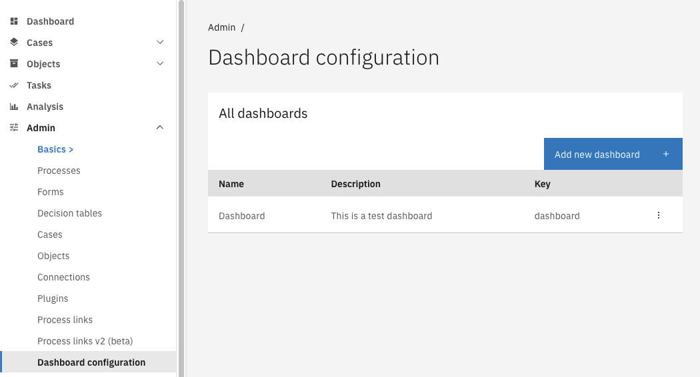
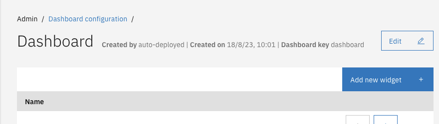
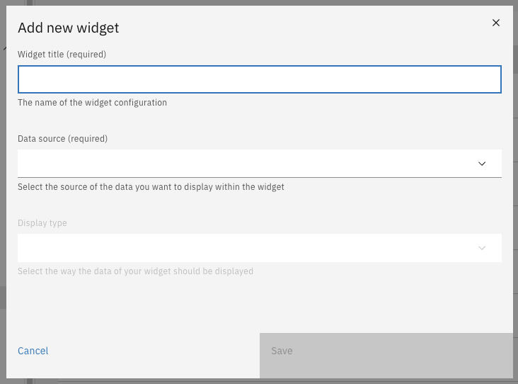

# Creating a dashboard

Dashboard with widgets can be configured manually using the [Admin UI](#configuration-using-the-admin-menu),
or by using autodeployment.

## Configuration using the Admin menu

The dashboard menu is found under the admin menu. Admin privileges are required to configure dashboards.

1. Go to the Admin menu
2. Go to the 'Dashboard' menu
3. Click the button 'Add new dashboard'
4. Fill in the form

When creating a dashboard, two fields need to be filled in:

- The 'Dashboard name' will be shown to the user on the dashboard page.
- The 'Description' field will never be shown to the user.

## Adding widgets

After creating a dashboard, widgets can be added to the dashboard.

1. Go to the Admin menu
2. Go to the 'Dashboard' menu
3. Click the dashboard that needs to be configured
4. Click the button 'Add new widget'
5. Fill in the form

### Adding widget: Case count

Currently, there is only one widget that is supported. That is the widget with datasource 'Case count' and display
type 'Big number'. This widget can be created by following the instructions above. More information on how to fill in
the form, can be found [here](/reference/modules/dashboard.md#case-count)
