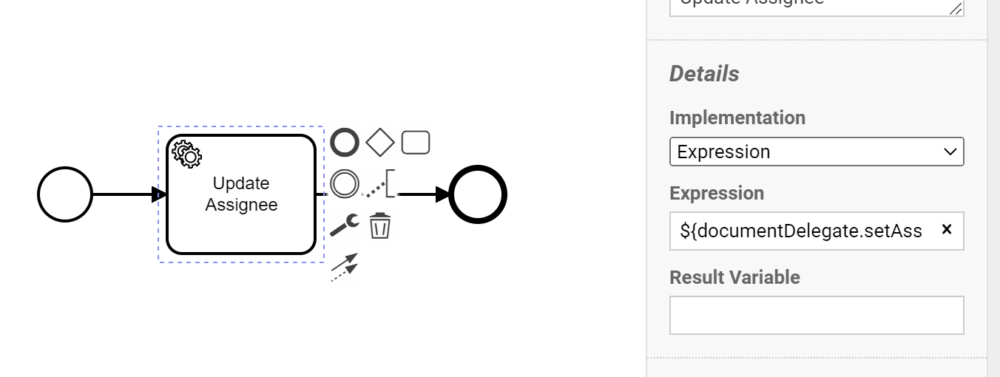

# Assigning a user to a document

Document assignees are users that have been put on a specific document. This is usually done 
when they are responsible for the next user task(s) and to tell other users they will work on
the document. This page will describe how a user can be set as the assignee of a document.

## Prerequisites

This page requires the following:
- The case definition is configured to allow for cases to be assigned to users.
- The user must have the correct role to access case types.
- This is the case when the case type is visible in the `Cases` menu.

## How to configure cases to be assignable

On the case management page, a setting can be changed to indicate that cases of that type can have an assignee. This can
be done by toggling the 'Case assignee' checkbox to enable assigning cases.


## Assigning using the user interface
In the menu `Cases` a case type must be selected and then a specific case must be opened.
On this page a `Claim` button is visible on the right side of the page. When the current 
user is not yet assigned to a document this button will be enabled. Pressing this button 
will assign the document to the user pressing the button.


## Assigning using a process
It is possible to assign a user to the current process by creating a service task and add the following expression:

```
${documentDelegate.setAssignee(execution, "email address of user")}
```

When this service task is reached the assignee will be set.



## Seeing the currently assigned users
When a user has been assigned using the claim button or a process, there are multiple ways this is presented. It is
shown on the case detail page just below the title of the page. Here it will show a label `Assigned to <user name>`.


Every time an assignee is changed this is also logged in the audit log. The log will show who changed
the assignee and who the new assignee is.


When a custom case column has been added with the propertyName `assigneeFullName` the current assignee will be 
shown on the table showing all current cases of a certain type.


[This page](/using-valtimo/document/custom-case-list-columns.md) describes how custom case columns can be added.

<!-- 
Add screenshots and uncomment this when the feature of unassigning a user becomes available.
Also update the filename, pagetitle and links when unassigning is available.

#Unassigning a user
When a user is currently assigned to a document it is possible to unassign the user.
To do this press the red x next to the name of the current assignee in the page title
of a case detail page.


-->
