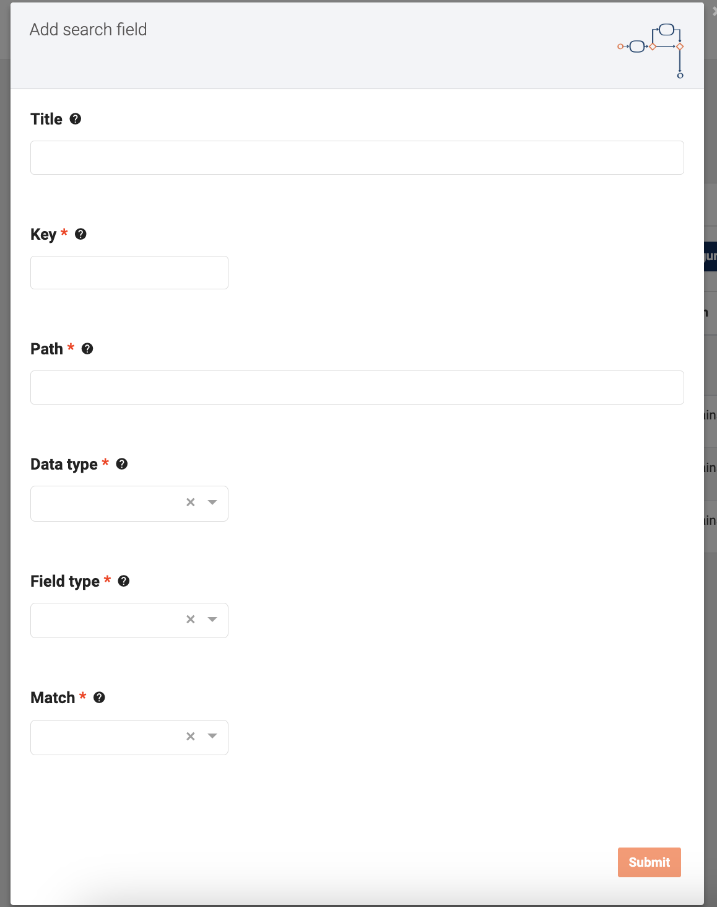

# Search fields

Search fields add the ability to filter cases. Each search field adds the ability to filter on a specific field.
This page describes how the search fields are used within Valtimo.

## Using search fields

Configured search fields can be found on the list page of every case type. So in order to 
find the search fields click on `Cases` in the menu and then select a specific case.

Above the list of cases is a box called `Search`.

By clicking on that box it will expand showing all the available search fields.

## Configure search fields

An administrator is able to add, change, remove, reorder and download a file with all search fields. To see all the 
configured
search fields go the menu `Admin > Cases` and select a specific case. Then click on the tab 
named `Search fields`.

### Available actions

**Edit**: When clicking on an entry in the list of `search fields`, a modal opens with the fields pre-filled with 
the selected item's data. It is possible to edit all the fields, except for the key.
When clicking `submit`, the field data is automatically updated in the list.

**Create**: A button to create a new search field is available at the top of the displayed search field list.
A modal for filling in the data will be presented when clicking on this button. It is necessary to fill in all the 
required data to enable the `submit` button. The key field is specific identification data, so if the key is not unique, 
you will not be able to save the search field.

**Delete**: By clicking on an entry `search fields`, a modal opens with the fields pre-filled with the data of the 
selected row. At the end of the modal, the button to delete the selected line is available. By clicking this button, 
the item is removed from the list.

**Download**: A button to download the list of `search fields` is available at the top of the displayed list. A file with all the information in the list, in json format, will be downloaded to the user's local machine.

**Reorder**: At the end of each row of the `search fields` list, there are two buttons for reordering the data. The 
line will be moved in the corresponding direction by clicking the up or down arrow button. When there is no possibility 
of moving the line, the reorder buttons will be disabled.

The component handles these types of search fields:

| Search field   | Available types                                                       | Editable       |
|:---------------|:----------------------------------------------------------------------|:---------------|
| **Title**      | Text                                                                  | _Editable_     |
| **Key**        | Text                                                                  | _Not editable_ |
| **Path**       | Text                                                                  | _Editable_     |
| **Data type**  | Text Number Date Date and time Boolean                | _Editable_     |
| **Field type** | Single Range Multi select dropdown Single select dropdown | _Editable_     |
| **Match type** | Exact Contains                                                    | _Editable_     |

**More information**

More information about configuring search fields can be
found [here](/extending-valtimo/document/configuring-search-fields.md#allowed-values).
