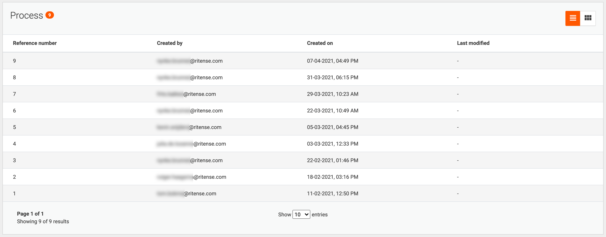

# Custom case columns

For each case type, a list overview can be opened. Which columns are displayed by default for all lists can be
configured. Also, a specific set of columns can be specified per case type.

| <!-- -->                                                      |
|---------------------------------------------------------------|
|  |
| 
Default case detail list
                     |