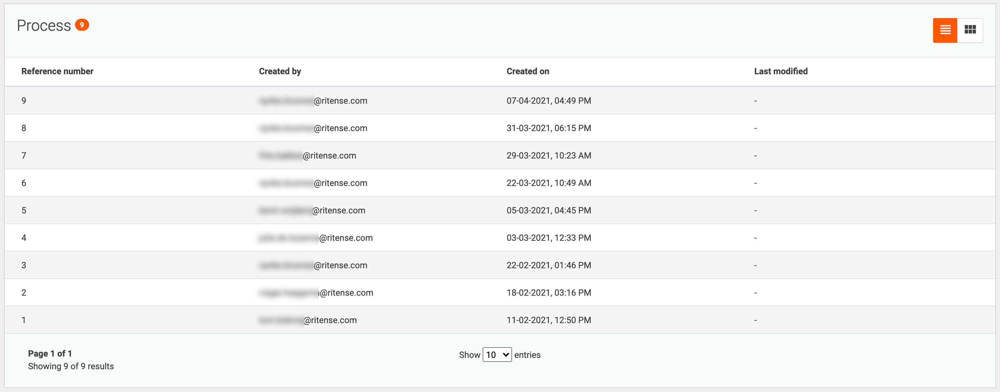

# Custom case list columns

This page show how the columns, that are shown in the list of cases, can be changed.

## Introduction

Each case list comes with a set of four default columns: 'Reference number', 'Created by', 'Created on',
and 'Last modified'. The columns in the list can be changed, added and removed. Any property stored in a document can be
used as a column in a case list.

| <!-- -->                                                      |
|---------------------------------------------------------------|
|  |
| <center>Default case list</center>                            |

## Default columns

In the environment file, the following default inline code is found for the case list columns. This defines the columns
that will be used in the case list, unless a custom column set has been configured for that case type.

#### **`environment.ts`**
  ```typescript
...

const defaultDefinitionColumns: Array<DefinitionColumn> = [
    {
        propertyName: 'sequence',
        translationKey: 'referenceNumber',
        sortable: true,
    },
    {
        propertyName: 'createdBy',
        translationKey: 'createdBy',
        sortable: true,
    },
    {
        propertyName: 'createdOn',
        translationKey: 'createdOn',
        sortable: true,
        viewType: 'date',
        default: true,
    },
    {
        propertyName: 'modifiedOn',
        translationKey: 'lastModified',
        sortable: true,
        viewType: 'date',
    },
];

...

export const environment: ValtimoConfig = {
    ...
    defaultDefinitionTable: defaultDefinitionColumns,
    ...
};
  ```

## Custom columns

The code shown above can be used as a starting point for custom columns. First add the line `customDefinitionTables: {}` 
below the line `defaultDefinitionTable: defaultDefinitionColumns`:

#### **`environment.ts`**
  ```typescript
...

export const environment: ValtimoConfig = {
    ...
    defaultDefinitionTable: defaultDefinitionColumns,
    customDefinitionTables: {}
    ...
};
  ```

Inside the brackets custom columns can then be defined:

#### **`environment.ts`**
  ```typescript
...

export const environment: ValtimoConfig = {
    ...
    defaultDefinitionTable: defaultDefinitionColumns,
    customDefinitionTables: {
        'document-definition-name' : [
            {
                propertyName: '$.firstName',
                translationKey: 'document-definition-name.firstName',
                sortable: false,
                viewType: 'string',
                default: true
            },
            {
                propertyName: 'modifiedOn',
                translationKey: 'lastModified',
                sortable: true,
                viewType: 'date'
            }
        ]
    }
    ...
};
  ```

For each case type for which custom columns are to be defined, a property is added to the `customDefinitionTables` 
object. The key of this property is the document definition id, and the value an array of `DefinitionColumn`, i.e.:  
`'document-definition-name': []`.

For each column that needs to be displayed for that case type a `DefinitionColumn` is added to the array. A 
`DefinitionColumn` has the following properties:

- **propertyName** The key from the document definition that is to be used to display column data. Default properties
like `sequence` can be written plainly. Document content can be accessed by referring to properties by their JSON path.
For example a `firstName` field in the root of the document can be displayed by using the expression `$.firstName`.
- **translationKey** The path to a translation in the translation files. In the above example, a combination of the
document definition name and the key from the document definition is used.
- **sortable** (Optional) A `boolean` value, which states whether the column should be sortable. Only enable this if the back-end
supports sorting on this property. Currently, the back-end supports sorting on `createdOn`, `modifiedOn`, `sequence` and
all JSON path expressions on the content. If not set, the column is not sortable.
- **viewType** (Optional) Refers to the type converter to be used for the property value, otherwise the
value will be displayed as a string. Examples of available type converters are `'date'`, `'boolean'`, `'relatedFiles `
and `'string'`.
- **default** (Optional) Marks the column as the default column to be sorted by when first loading the page. Only one of the 
columns in the array of columns can have this property. If set to `true`, the table is sorted on this property 
*descendingly*. The sort direction may also be specified specifically by setting this property value to `'ASC'` or 
`'DESC'`.

Custom columns can be appended to the default list of columns instead of replacing them by using the spread operator (...):

#### **`environment.ts`**
  ```typescript
...

export const environment: ValtimoConfig = {
    ...
    defaultDefinitionTable: defaultDefinitionColumns,
    customDefinitionTables: {
        'document-definition-name' : [
            ...defaultDefinitionColumns,
            {
                propertyName: '$.firstName',
                translationKey: 'document-definition-name.firstName',
                sortable: false,
                viewType: 'string',
            }
        ]
    }
    ...
};
  ```

## Translations

Translations of the column header can be added in the translation resource files (e.g. `en.json` and `nl.json`) by adding
the translation keys under the `fieldLabels` key.

#### **`en.json`**
  ```json
{
  ...
  "fieldLabels": {
    ...
    "document-definition-name": {
      "firstName": "First name"
    }
  },
  ...
}
  ```
