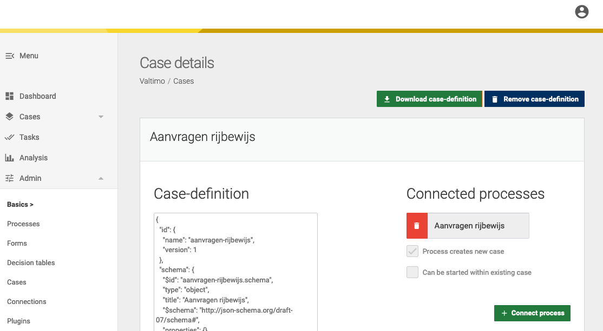
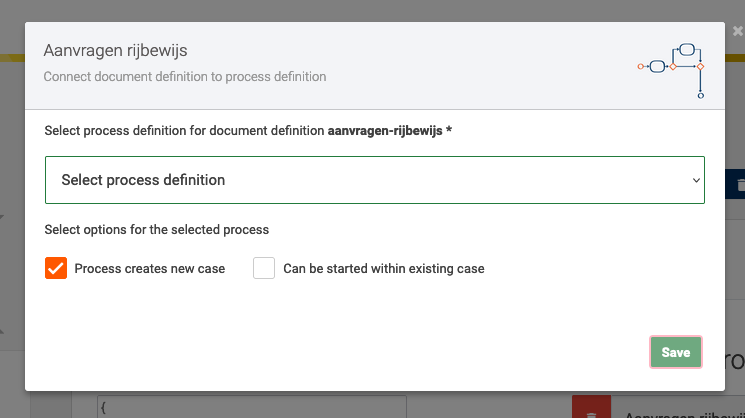

# How to link a process to a case

Before a [process can be started](start-case.md), the process has to be linked to a case first. This page describes how
a process can be linked to a case.

### Prerequisites

This page requires the following:
- A [document definition](create-document-definition.md).
- A process definition.

## Linking via UI

To link a process to a case, the following steps are necessary:

1. Go to the Admin menu
2. Go to the Cases menu
3. Select the case the process should be linked to.

   

4. Follow the steps

    

## Linking via code

In addition to linking a case via the UI, it is possible to link a case through code. The following steps are necessary:

1. Create a process document link file (ending with `.json`) under the following path:
   `*/resources/config/process-document-link`. The name should correspond with the document definition ID (e.g. a document
   definition `aanvragen-rijbewijs.schema.json` with the ID `aanvragen-rijbewijs.schema` requires the process document
   file to be named `aanvragen-rijbewijs.json`.
2. Specify the process(es) that should be linked to the document. More than one process can be linked to the same
   document.

```json
[
    {
        "processDefinitionKey": "rijbewijs-aanvraag",
        "canInitializeDocument": true,
        "startableByUser": true,
        "processIsVisibleInMenu": true
    }
]
```
