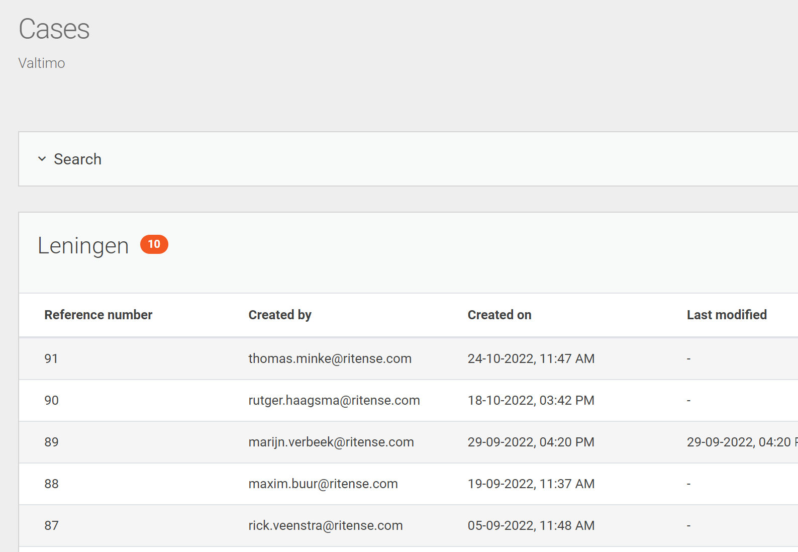

# Search fields

Search fields add the ability to filter cases. Each search field adds the ability to filter on a specific field.
This page describes how the search fields are used within Valtimo.

## Using search fields

Configured search fields can be found on the list page of every case type. So in order to 
find the search fields click on `Cases` in the menu and then select a specific case.

Above the list of cases is a box called `Search`.

By clicking on that box it will expand showing all the available search fields

## Configure search fields

An administrator is able to add, change and remove search fields. To see all the configured
search fields go the menu `Admin > Cases` and select a specific case. Then click on the tab 
named `Search fields`

