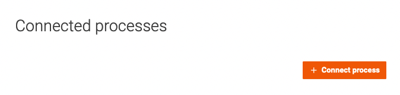
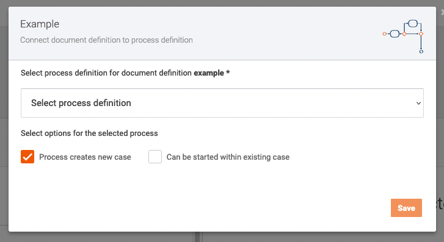
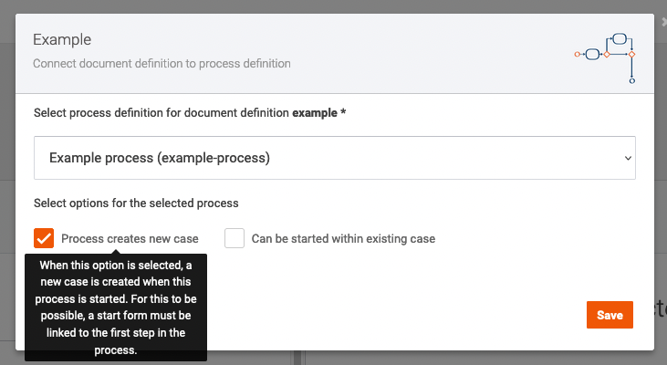
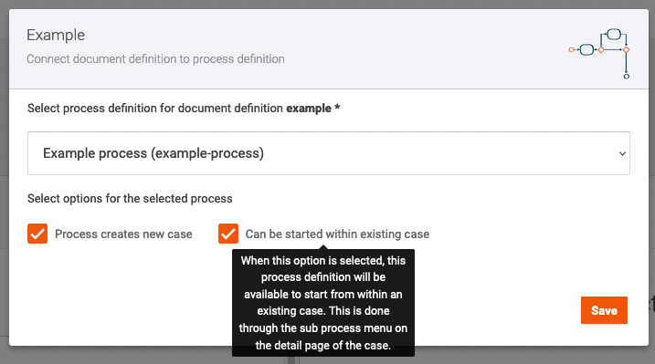
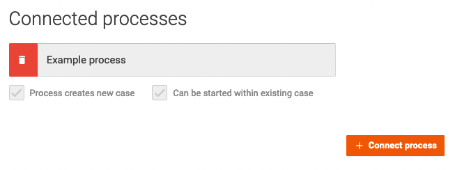

# How to start a process for a case

There are two ways to start a process for a case by using the user interface:
- Starting a process with a new case
- Starting a process for an existing case

## Setting up Valtimo to start a process

To start a new case through the user interface a process has to be connected to it. On the case definition detail page 
process definitions can be linked to the case definition. This will tell Valtimo what processes, and by extension what 
forms, are available to be started for a case.

Processes are linked by going to the case detail page by choosing `Admin` &rarr; `Cases` in the menu, and then clicking 
in the list on the case to link the process to. On this page the list of connected process definitions is displayed.

To add another process for the case the `Connect process` button can be used to bring up the popup.

In the dropdown box, the process definition can be chosen that will be available for this case definition.
There are 2 checkboxes available to chose how the user can use the process for this case definition.

The first checkbox marks it as a process that can be used to start a new case for the current case definition.
This will use the form linked to the start event of the BPMN model as the form that is used when creating a new case.

The second checkbox marks it as a process that can be used for existing cases. It will add the process to the list of
available processes in the dropdown on the case detail page.

After saving the process is available to be used. 

## Starting a process with a new case

To start a new process and case a button is available on the case list page. This can be opened by selecting `Cases`
from the menu and selecting the case type to start.

By using the `Create New Case` button, a popup is opened containing the start form of the process connected to the case
definition.

After submitting the form a new case is started, and a process is started for the case. The progress of the process can
be viewed on the `Progress` tab. 

## Starting a process for an existing case

To start new process for an existing case a button is available on the case detail page. This can be opened by 
selecting `Cases` from the menu and selecting the case type, then clicking on a case in the list.

By clicking the `Start` button on the top right of this page, a list is displayed containing all available processes to
be started.

After choosing one of the processes from the list, the corresponding start form is opened in a popup.

After submitting the form, the process is started.