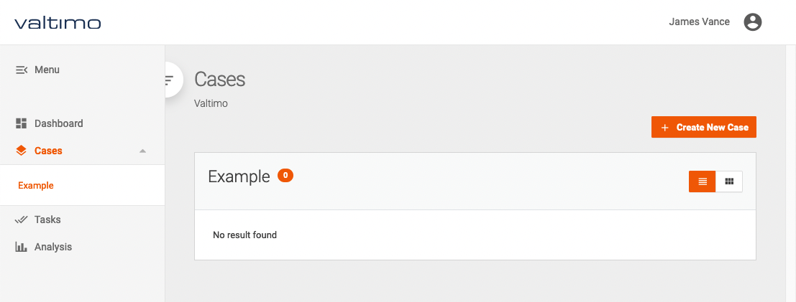
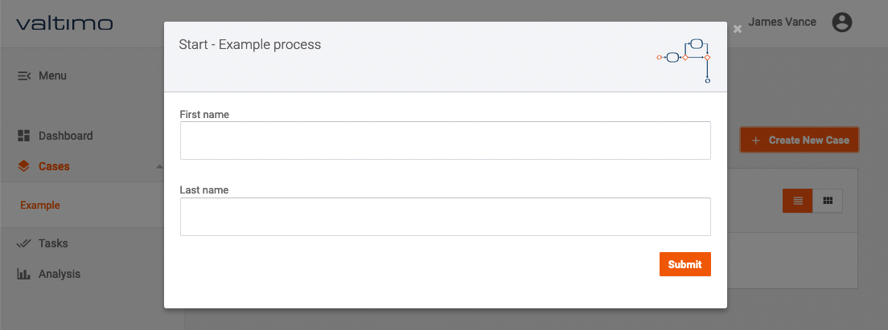
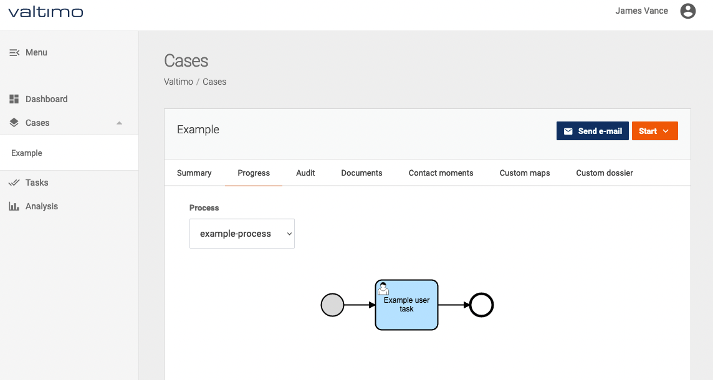
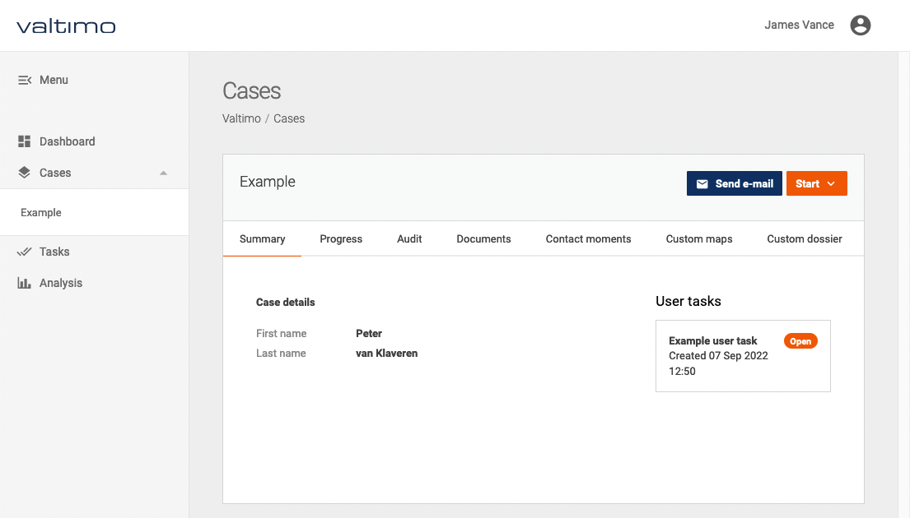
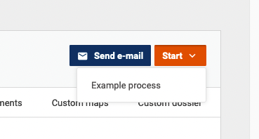
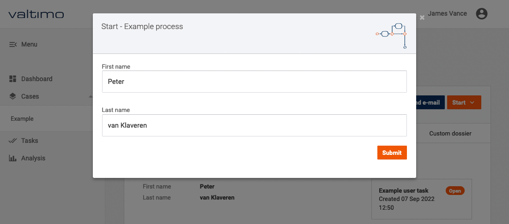

# How to start a process for a case

There are two ways to start a process for a case by using the user interface:
- Starting a process with a new case
- Starting a process for an existing case

To be able to start a new case through the user interface a process has to be connected to it. 
[How to link a process to a case](link-process-and-case.md).

## Starting a process with a new case

To start a new process and case a button is available on the case list page. This can be opened by selecting `Cases`
from the menu and selecting the case type to start.

By using the `Create New Case` button, a popup is opened containing the start form of the process connected to the case
definition.

After submitting the form a new case is started, and a process is started for the case. The progress of the process can
be viewed on the `Progress` tab. 

## Starting a process for an existing case

To start new process for an existing case a button is available on the case detail page. This can be opened by 
selecting `Cases` from the menu and selecting the case type, then clicking on a case in the list.

By clicking the `Start` button on the top right of this page, a list is displayed containing all available processes to
be started.

After choosing one of the processes from the list, the corresponding start form is opened in a popup.

After submitting the form, the process is started.