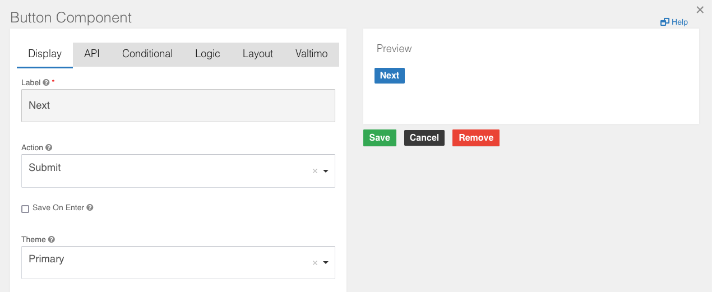
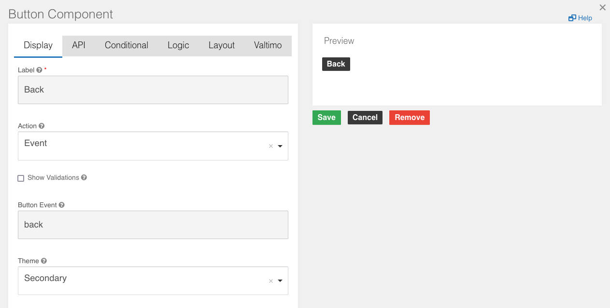

# Creating a Form.io form for form flow

## Completing a step

To complete a step in the form flow, the button should be configured with:

- Action: `Submit`

For example:

## Going back to the previous form

A button can be configured to go a back to the previous form in the form flow. This 'Back' button should be configured
with:

- Action: `Event`
- Button Event: `back`

For example:
