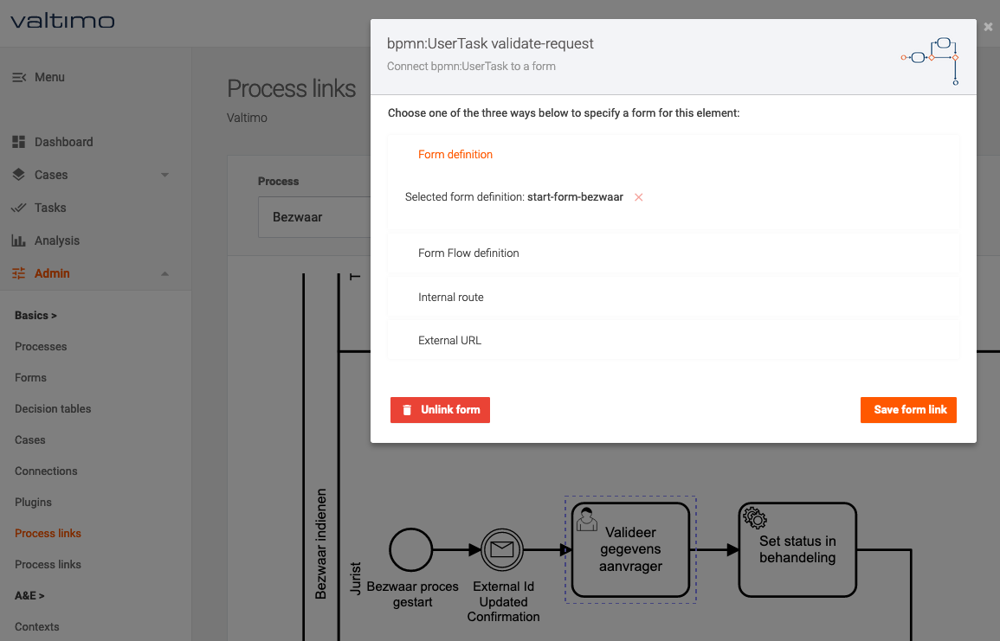
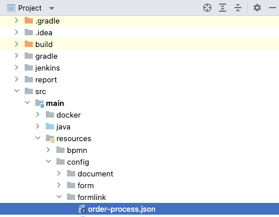

# How to link a form to a task

There are two ways to connect a form to a task, with a preliminary step to ensure the form can be
found. What this preliminary step is depends on the type of form that should be linked to a task.

## Configuring a form link through the UI

To create a form link for a start event or user task, the following steps are necessary:

1. In the admin menu, go to "Process links". This shows a  select box, specifying which process and
   version is being configured, as well as a diagram for the current selection.
2. Select the process and version that should be configured.
3. Select a start event or user task.
4. Select the type of form link and follow the specific instructions.



## Configuring a form link through application project files

In order to connect a form or form flow to a task, the following steps are necessary:

1. Create a form link `.json` file under the following path: `*/resources/config/formlink/`. 
The name of the file needs to correspond to the process definition key.

   

3. Create the form links. An example of what this looks like can be found below:

    ```json
    [
        {
            "formName": "order.start",
            "formLinkElementId": "OrderStartEvent",
            "formAssociationType": "start-event"
        },
        {
            "formFlowName": "order.submit-request-task",
            "formLinkElementId": "SubmitRequestTask",
            "formAssociationType": "user-task"
        },
        {
            "formName": "order.control-and-complete-request-task",
            "formLinkElementId": "ControlAndCompleteRequestTask",
            "formAssociationType": "user-task"
        }
    ]
    ```
