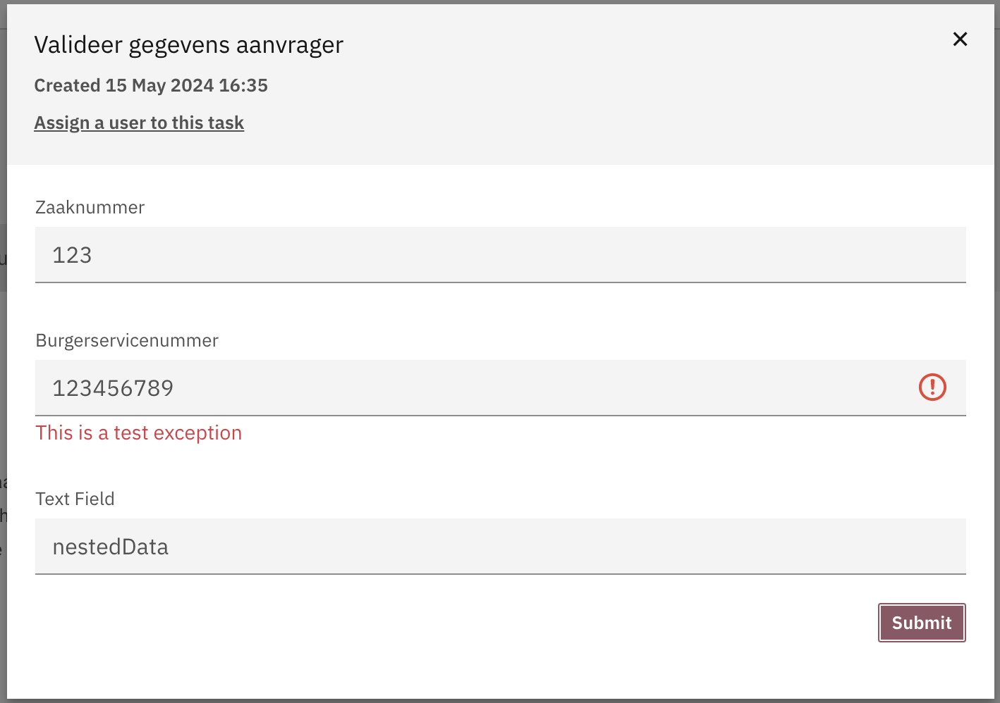
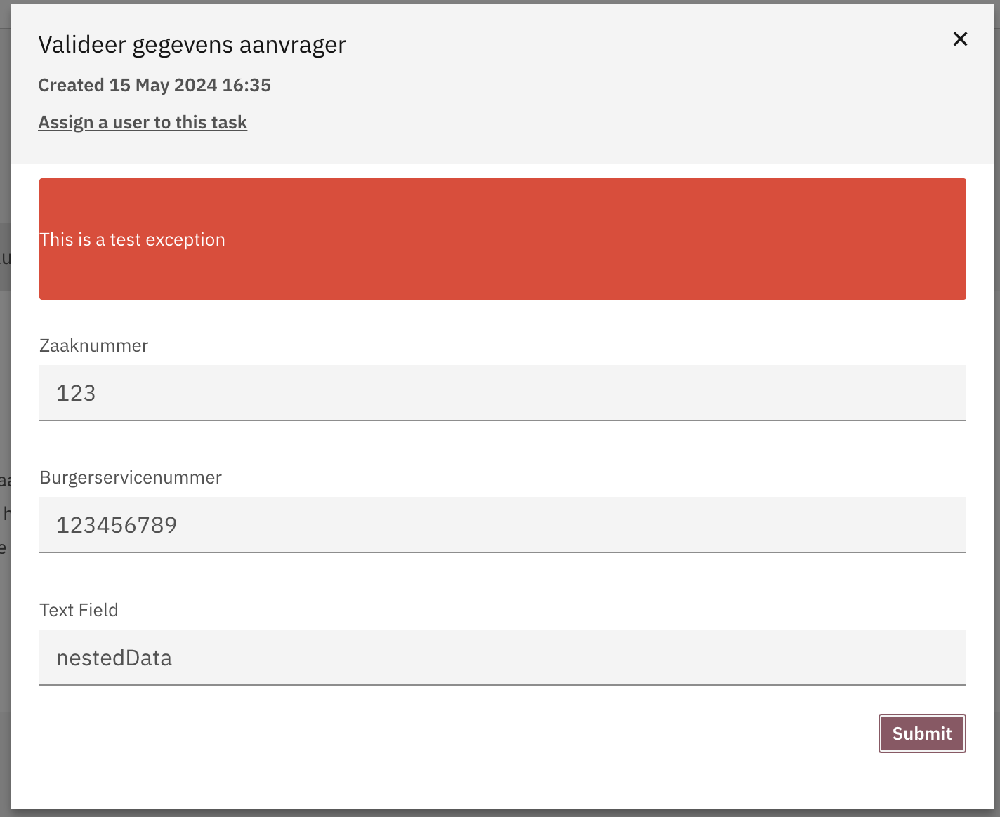

# Error handling on ViewModel and Submission

During ViewModel retrieval and Submission processing things can go wrong. 
In order to capture these errors you can throw a `FormException`.

This exception will be caught and converted into a FormError object which will be returned to the frontend.

`FormException` also has a component property that in case you want the message to be displayed for a specific component.

Leaving the component empty will result in a message above the form.

During the execution of commands you are also able to throw a FormException.

## FormException:
```kotlin
class FormException(
    message: String,
    val component: String? = null,
    cause: Throwable? = null
) : Exception(message, cause)
```

This is the JSON representation of the error:
```json
{
  "error": "...",
  "component": "componentName"
}
```

Form field error rendered above the form field



Form error rendered above the form




During command handling you can also throw a `BusinessException`. This is similar to `FormException` but it will only show on top of the form

## BusinessException:
```kotlin
class BusinessException(
    message: String,
    cause: Throwable? = null
) : Exception(message, cause)
```
