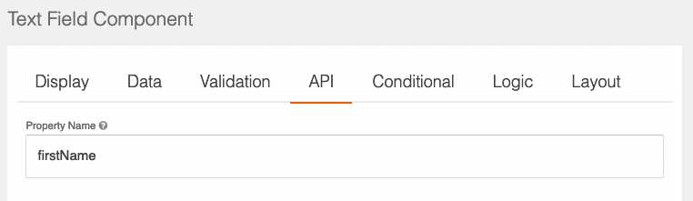
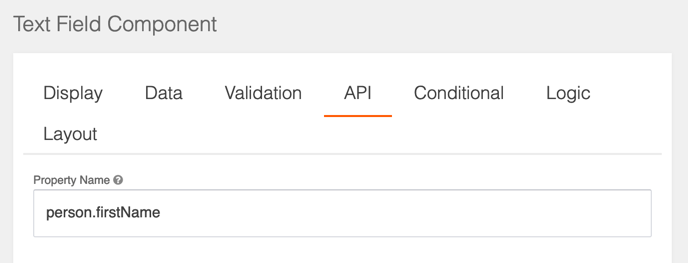

# Creating FormIO forms in Valtimo

In Valtimo, forms can be prefilled with data from a case or from other external sources. This page describes how 

## Case data

By default, when creating fields in a form the data will be retrieved from and stored in the case. The property of the
case that is used depends on the 'Property Name' field on the 'API' tab of the field settings. 

In the example below a document definition is defined with the `firstName` property. A form field is created that 
corresponds to this property to allow data to be loaded and saved.

Document definition:
```json
{
  "$id": "example.schema",
  "type": "object",
  "title": "Example",
  "$schema": "http://json-schema.org/draft-07/schema#",
  "properties": {
    "firstName": {
      "type": "string",
      "description": "First name"
    }
  }
}
```
Field configuration:



It is also possible to load properties from an object within the document. In the example below the document definition
contains an object 'person', that has a 'firstName' property. This property can be accessed by using `person.firstName` 
as the field property name.

Document definition:
```json
{
  "$id": "example.schema",
  "type": "object",
  "title": "Example",
  "$schema": "http://json-schema.org/draft-07/schema#",
  "properties": {
    "person": {
      "type": "object",
      "properties": {
        "firstName": {
          "type": "string",
          "description": "First name"
        }
      }
    }
  }
}
```

Field configuration:



## External data

In some cases there is other data related to the case, but not part of the document that needs to be displayed in a 
form. The form module allows for `FormFieldDataResolver` to fetch data by using expressions as property name in forms.
On loading the form the data is automatically preloaded. The expression generally looks like `<prefix>:<field-expression>` 
where the prefix indicates which `FormFieldDataResolver` is used. The `<field-expression>` in this expression gives the 
resolver information on what data to load. For example, when using the expression `oz:firstName` for a field, the
`OpenZaakFormFieldDataResolver` is used to access the zaakeigenschappen in the Zaken API and get the `firstName` property.

Even though technically a `FormFieldDataResolver` is not used, the prefix `pv` is available to access the process 
variables in functionally the same way. For example, the expression `pv:age` would try to get the 'age' variable from 
the process variables.

A list of `FormFieldDataResolvers` that are available on the [forms reference page](/reference/modules/form.md#external-data-types).

A description on how to create a new `FormFieldDataResolver` is available on the 
[creating form data resolver page](../../extending-valtimo/forms/creating-form-field-data-resolver.md)

## Disabled fields

Disabled form fields are prefilled and saved by default. This behaviour deviates from the web-standard where disabled elements are not included in the submit body.

This behaviour can be changed by setting a toggle in application.yml:
  ```yaml
  valtimo:
      form:
        ignoreDisabledFields: true
  ```

When set to true, disabled fields will no longer be prefilled or saved. The default value is false.

## Disabling prefill
<sub>Available since 10.5.0</sub>

In some cases it is desirable to be able to disable a form input prefill. For example, an upload input might result in duplicate files when prefilled.

To disable prefilling a component, the `prefill` property can be set in the FormIO definition:

```json
{
  "key": "file-attachments",
  "type": "valtimo-file",
  "input": true,
  "label": "Relevant files",
  "prefill": false,
  ...
}
```

In contrast to [Disabled fields](#disabled-fields), setting this property to false will still save the result in the document.

