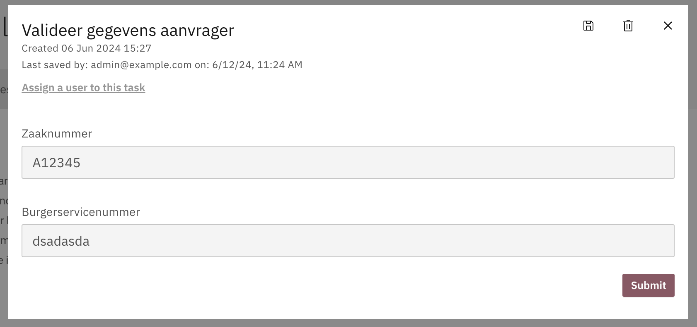

# Intermediate submission

When filling out a Usertask form, users may want to save their changes and complete the task later without losing any data. Forms can have many fields, making it difficult to complete them all at once. Therefore, users might need to view and fill in fields multiple times. To support this, changes can be stored intermittently between editing sessions.

This optional feature can be enabled with a feature toggle.
```TypeScript
{
    featureToggles: {
        enableIntermediateSave: true
    }
}
```

### Saving the intermediate submission

When enabled, users can save their changes by clicking the floppy disk icon in the top right corner of the form. They can then close the form and return later to continue filling in the fields.



### Clearing the intermediate submission

To reset the form, click the waste bin button. A confirmation dialog will appear to confirm the action.


