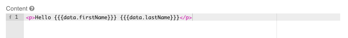
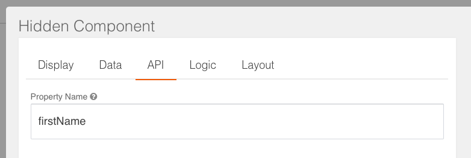
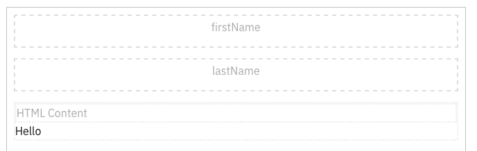
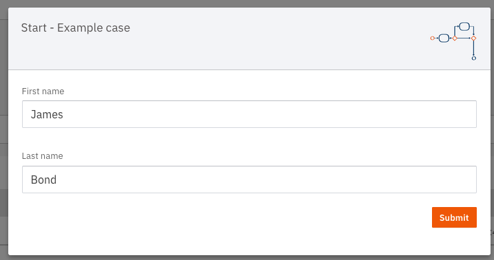
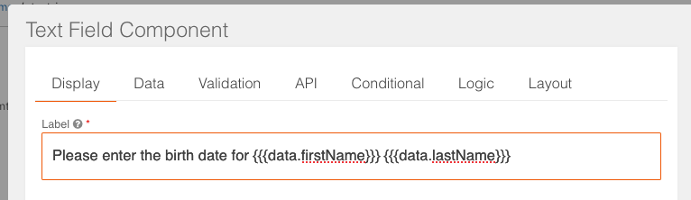
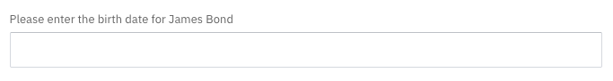
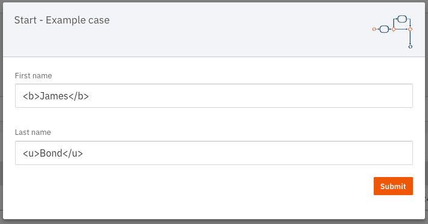
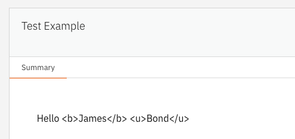
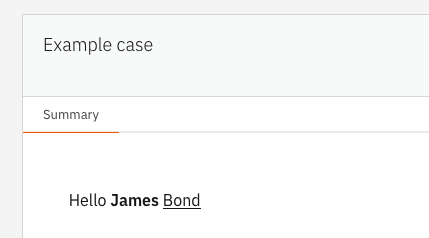

# Interpolating data in Form.io

Data can be included in Form.io forms in multiple ways. One of the more common ways is to interpolate variables in 
field descriptions and HTML type fields. 

## How to interpolate data

By adding expressions to any text field in the form configuration, it is possible to use variables in that text. 
The example below shows how the name stored in the case document can be used in a HTML field in a form. This is used to 
display the name as part of a message.

First, when configuring the field an expression is used that will combine the data. More information on the syntax can 
be found below in the section [Available syntaxes](#available-syntaxes). 

Only data that Form.io has access to at runtime can be used in the expression. This means that any data from the case
document that needs to be displayed, first needs to be made available to Form.io. This can be done by for example adding 
a hidden field in the same form that the data will be prefilled in.

This results in the following form:

When creating a case with the required information that will be stored. 

This data is used in the form to display the name in the message.

This same feature can be used in other text fields. For example, the label of a field can also be dynamically
changed.

Which results in the following field.

## Available syntaxes

There are two different syntaxes for interpolating data in Form.io forms:
- `{{ expression }}` for interpolation and escaping
- `{ expression }` for only interpolation

Because the data that is interpolated in the form can come from the user, it is important to escape the data to prevent
it from being interpreted as HTML. This can be done by using the `{{ expression }}` syntax. 

For example if a user were to enter the following text in a form fields.

This would result in the following text being displayed in the form when using the `{{ expression }}` syntax

When using the `{ expression }` syntax, the data is not escaped. This means that the data is interpreted as HTML as 
shown below.

It is recommended to always use the `{{ expression }}` syntax to prevent any issues with the data being displayed, 
unless it is intended to use HTML in the form and the data is trusted.
