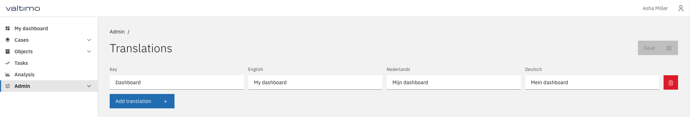
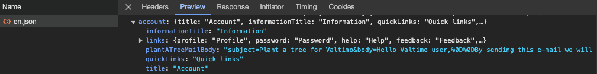
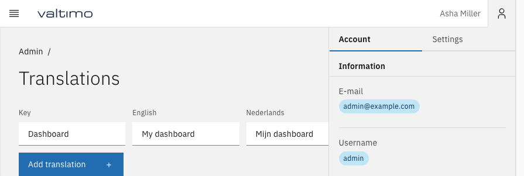
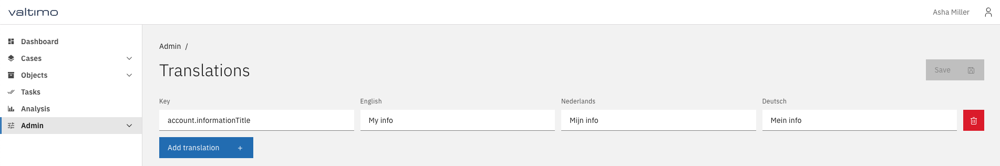
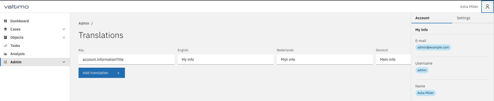

# Configuring localization

The front-end of Valtimo supports localization. The front-end libraries include default translations for main
application functionality. These translations can be extended and overridden in a variety of ways.

## Custom translation resources

Custom JSON translation files can be added to an implementation by adding a reference to the directory in which they
are located to the environment file. In the referenced directory, the translation files must have the language for
which they contain translations in their file names; i.e. `src/assets/i18n/nl.json`, `src/assets/i18n/de.json` and
`src/assets/i18n/en.json`.

The corresponding environment file would then contain the following `translationResources` key:

#### **`src/environments/environment.ts`**
```typescript
...

export const environment: ValtimoConfig = {
    ...
    translationResources: [
        './assets/i18n/'
    ],
    ...
};
```

### Multi translation loader

The Valtimo front-end uses `@ngx-translate/core'` for its translations. In addition, a custom `TranslateLoader` must be
provided to it, in order to support translation files from multiple locations. This can be accomplished by providing
this custom loader in the app module:

#### **`src/app/app.module.ts`**
```typescript
...
import {HttpBackend, ...} from '@angular/common/http';
import {TranslateLoader, TranslateModule} from '@ngx-translate/core';
import {..., ConfigService, MultiTranslateHttpLoaderFactory} from '@valtimo/config';
...

@NgModule({
    ...
    imports: [
        ...
        TranslateModule.forRoot({
            loader: {
                provide: TranslateLoader,
                useFactory: MultiTranslateHttpLoaderFactory,
                deps: [HttpBackend, ConfigService],
            },
        }),
        ....
    ],
    ...
})
export class AppModule {
    ...
}

```

## Admin configurable translations

From Valtimo front-end and back-end libraries version `12.0.0` and up, it is possible for an administrator to configure
translations from the user interface. 

### Custom translation loader

In order to make translations received from the back-end possible, a custom translation loader must be added to the app
module. This replaces the [multi translation loader](#multi-translation-loader) mentioned previously. This custom loader
supports loading translation resources from the environment file, in addition to receiving translations from the
back-end. Any translations received from the back-end will have priority over other translations. Look at the following
example to configure this custom loader. In addition, do not forget to add `TranslationManagementModule` to the
`AppModule` imports.

#### **`src/app/app.module.ts`**
```typescript
...
import {HttpBackend, HttpClient, ...} from '@angular/common/http';
import {TranslateLoader, TranslateModule} from '@ngx-translate/core';
import {
    ...,
    ConfigService,
    CustomMultiTranslateHttpLoaderFactory,
    LocalizationService,
} from '@valtimo/config';
import {..., TranslationManagementModule} from '@valtimo/layout';
...

@NgModule({
    ...
    imports: [
        ...
        TranslateModule.forRoot({
            loader: {
                provide: TranslateLoader,
                useFactory: CustomMultiTranslateHttpLoaderFactory,
                deps: [HttpBackend, HttpClient, ConfigService, LocalizationService],
            },
        }),
        TranslationManagementModule,
        ....
    ],
    ...
})
export class AppModule {
    ...
}

```

### Add translation management page

After configuring the `CustomMultiTranslateHttpLoaderFactory` and importing `TranslationManagementModule`, a link to
the translation management page must be added to your implementations environment file:

#### **`src/environments/environment.ts`**
```typescript
...

export const environment: ValtimoConfig = {
    ...
    menu: {
        menuItems: [
            ...
            {
                roles: [ROLE_ADMIN],
                ...
                children: [
                    ...
                    // add a link to translation-management in your menu configuration. Make sure the sequence number is unique
                    {link: ['/translation-management'], title: 'Translations', sequence: 12},
                    ...
                ],
            },
        ],
    },
    ...
};
```

### Admin configuration of translations

After following the above-mentioned steps, an administrator can now navigate to `/translation-management`. On this page,
custom translation keys can be configured, which will be available directly in any custom component code using the 
`translate` pipe provided by `'@ngx-translate/core'`.

In addition, any existing translations can be overridden by supplying its exact key. In this example, the title
displayed for Dashboard in the left sidebar is overridden by supplying the translation key it uses, which is
`Dashboard`. Now, `My dashboard` is displayed when the application is set to English.



Any nested translations can also be overridden by using the dot notation. For example, notice `account.informationTitle`
is defined in the translation files:



This translation is displayed in the right sidebar as "Information":



We can override this text by providing the exact key using the dot notation, and then providing our own translations:



Finally, our custom translation is displayed in the sidebar on reloading the page:




