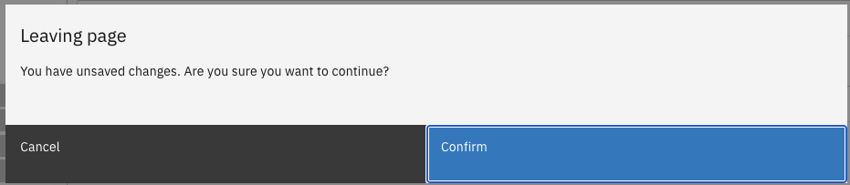

# Pending Changes mechanism

The PendingChanges mechanism is meant to prevent data loss when navigating away from a page with unsaved changes.



In order for the mechanism to work, both the routing module and the component for which to apply it need to be configured.

## Configuring your Router:

Router needs to be configured to accept cancelling navigation.

#### **`example-routing.module.ts`**

```typescript
...
// import Router
import { Router } from '@angular/router';
...
// import RouterUtils from @valtimo
import {RouterUtils} from '@valtimo/config';
...
// import PendingChangesGuard from @valtimo
import {pendingChangesGuard} from '@valtimo/components';
...

// apply guard to routes
...
    const routes: Routes = [
      ...
      {
        ...,
        path: 'example-path',
        component: 'example-component',
        canDeactivate: [pendingChangesGuard]
        ....
      }
      ...
    ]
...
export class ExampleRoutingModule {
    ...
    constructor(private router: Router) {
      RouterUtils.configureRouter(this.router)
    }
}
```

## Configuring your component

Any component that needs to use the mechanism needs to tell it when to be triggered and when not to.

#### **`example.component.ts`**

```typescript
...
// import PendingChangesComponent from @valtimo
import { PendingChangesComponent } from '@valtimo/components';

...
//import modalService and translateService for the Modal to work
import {ModalService} from 'carbon-components-angular';
import {TranslateService} from '@ngx-translate/core';
...

...
// Make the component targetable by the PendingChanges guard
export class ExampleComponent extends PendingChangesComponent {
    ...
    // initialize PendingChangesComponent
    constructor(
      private modalService: ModalService,
      private translateService: TranslateService
    ) {
      super(modalService, translateService)
    }
    ...

    ...
    // let the component know the guard needs to be triggered
    public exampleDoChange(): void {
      //pendingChanges is an attribute of the PendingChangesComponent that lets it know the guard might need to be triggered
      this.pendingChanges = true;
      ...
    }

    ...
    // let the component know the changes have been saved
    public exampleSaveChanges(): void {
      ...
      this.pendingChanges = false;
    }
    ...
}
```

## Custom handlers when closing the PendingChanges modal

In case custom handlers need to be added when selecting either *Confirm* or *Cancel*, the PendingChangesComponent has two *protected* methods that can be overwritten for that purpose.

#### **`pending-changes.component.ts`**

```typescript
...
  protected onCancelRedirect(): void {}

  protected onConfirmRedirect(): void {}
...
```

When overwriting these method, the logic inside of them gets triggered right before closing the modal.

#### **`example.component.ts`**

```typescript
...
// import PendingChangesComponent from @valtimo
import { PendingChangesComponent } from '@valtimo/components';

...
//import modalService and translateService for the Modal to work
import {ModalService} from 'carbon-components-angular';
import {TranslateService} from '@ngx-translate/core';
...

...
// Make the component targetable by the PendingChanges guard
export class ExampleComponent extends PendingChangesComponent {
    ...
    // initialize PendingChangesComponent
    constructor(
      private modalService: ModalService,
      private translateService: TranslateService
    ) {
      super(modalService, translateService)
    }
    ...

    ...
    // overwrite onCancelRedirect method
    protected onCancelRedirect(): void {
      //custom logic for canceling of navigation
    }
    ...
}
```
