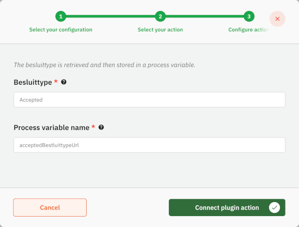

# Using the Catalogi API Plugin

The Catalogi API plugin can be used to access data stored in a ZGW (zaakgericht werken) catalogue. This is based on the
Catalogi API standard created and used by the Dutch government. 

## Configure the plugin

A plugin configuration is required before the plugin can be used. A general description on how to configure
plugins can be found [here](../configure-plugin.md).

If the Catalogi API plugin is not visible in the plugin menu, it is possible the application is missing a dependency.
Instructions on how to add the Catalogi API dependency can be found
[here](/getting-started/modules/zgw/catalogi-api.md).

To configure this plugin the following properties have to be entered:
- **URL (`url`).** Contains the complete base URL of the Catalogi API to connect to. This generally includes 
the path `/api/v1/`.
- **Authentication plugin configuration (`authenticationPluginConfiguration`).** Reference to another plugin configuration that will be used to add 
authentication to any request performed on the Catalogi API. If no option is available in this field a plugin has to 
be configured that is able to authenticate for the specific application that hosts the Catalogi API. (e.g. OpenZaak)

An example plugin configuration:

## Available actions

The Catalogi API plugin supports the following actions that can be configured in process links in order to retrieve type 
data.

A general description on how to create process links can be found [here](../../process-link/create-process-link.md).

### Retrieve statustype
This action retrieves the statustype URL using the statustype description, and will assign it to a process variable. 

When creating a process link the following properties have to be entered:
- **Statustype**. This description will be used to lookup the full statustype URL 
  
    A full URL can also be set here. In that case, the value will be used directly without a lookup.
- **Process variable name**. This is the name of the process variable which value will be set to the found statustype URL.

An example action configuration:

### Retrieve resultaattype
This action retrieves the resultaattype URL using the resultaattype description, and will assign it to a process variable.

When creating a process link the following properties have to be entered:
- **Resultaattype**. This description will be used to lookup the full resultaattype URL

  A full URL can also be set here. In that case, the value will be used directly without a lookup.
- **Process variable name**. This is the name of the process variable which value will be set to the found resultaattype URL.

An example action configuration:

### Retrieve besluittype
This action retrieves the besluittype URL using the besluittype description, and will assign it to a process variable.

When creating a process link the following properties have to be entered:
- **Besluittype**. This description will be used to lookup the full besluittype URL

  A full URL can also be set here. In that case, the value will be used directly without a lookup.
- **Process variable name**. This is the name of the process variable which value will be set to the found besluittype URL.

An example action configuration:

## Available actions

The Catalogi API plugin supports the following actions that can be configured in process links in order to retrieve type 
data.

A general description on how to create process links can be found [here](../create-process-link.md).

### Retrieve statustype
This action retrieves the statustype URL using the statustype description, and will assign it to a process variable. 

When creating a process link the following properties have to be entered:
- **Statustype**. This description will be used to lookup the full statustype URL.
    A full URL can also be set here. In that case, the value will be used directly without a lookup.
- **Process variable name**. This is the name of the process variable which value will be set to the found statustype URL.

An example action configuration:

### Retrieve resultaattype
This action retrieves the resultaattype URL using the resultaattype description, and will assign it to a process variable.

When creating a process link the following properties have to be entered:
- **Resultaattype**. This description will be used to lookup the full resultaattype URL.
  A full URL can also be set here. In that case, the value will be used directly without a lookup.
- **Process variable name**. This is the name of the process variable which value will be set to the found resultaattype URL.

An example action configuration:

### Retrieve besluittype
This action retrieves the besluittype URL using the besluittype description, and will assign it to a process variable.

When creating a process link the following properties have to be entered:
- **Besluittype**. This description will be used to lookup the full besluittype URL.
  A full URL can also be set here. In that case, the value will be used directly without a lookup.
- **Process variable name**. This is the name of the process variable which value will be set to the found besluittype URL.

An example action configuration:

