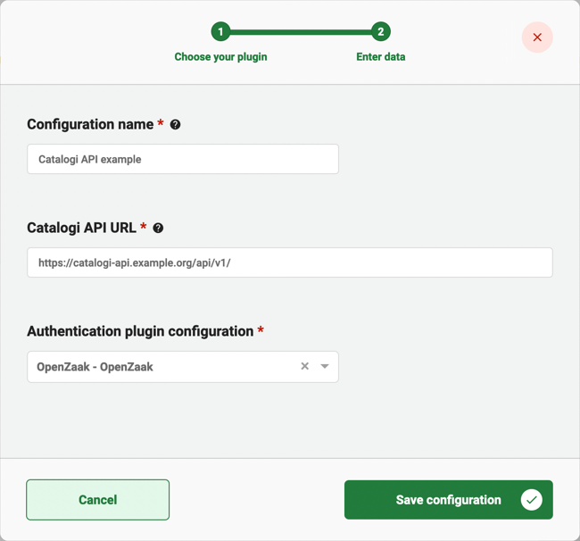

# Using the Catalogi API Plugin

The Catalogi API plugin can be used to access data stored in a ZGW (zaakgericht werken) catalogue. This is based on the
Catalogi API standard created and used by the Dutch government. 

## Configure the plugin

A plugin configuration is required before the plugin can be used. A general description on how to configure
plugins can be found [here](../configure-plugin.md).

If the Catalogi API plugin is not visible in the plugin menu, it is possible the application is missing a dependency.
Instructions on how to add the Catalogi API dependency can be found
[here](/getting-started/modules/zgw/documenten-api.md).

To configure this plugin the following properties have to be entered:
- **URL.** Contains the complete base URL of the Catalogi API to connect to. This generally includes 
the path `/api/v1/`.
- **Authentication plugin configuration.** Reference to another plugin configuration that will be used to add 
authentication to any request performed on the Catalogi API. If no option is available in this field a plugin has to 
be configured that is able to authenticate for the specific application that hosts the Catalogi API. (e.g. OpenZaak)

An example plugin configuration:

