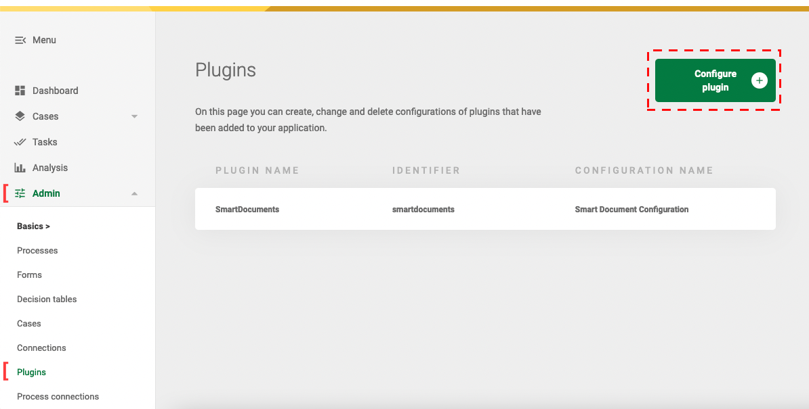

# Configuring Plugins

Plugins can be configured in the plugin menu in Valtimo. The plugin menu is found under the admin menu. Admin privileges
are required to configure plugins.

Instructions for using the configuration to link an action to a process task can be found 
[here](../process-link/create-process-link.md).

## Setup
Before plugins can be configured, both the backend and frontend dependencies are needed. 
See [here](../../getting-started/modules/core/plugin.md) for instructions on how to do this.

## Adding plugin configuration

1. Go to the Admin menu
2. Go to the Plugin menu
3. Click the button 'Configure plugin +'
4. Select the plugin definition
5. Configure the plugin



## Autodeployment
Plugin configurations can also be deployed when starting the application.

This can be done by creating one or more files anywhere on the classpath (resource folder) matching the following pattern: 
`*.pluginconfig.json`

An example configuration can be found below:
```json
[
  {
    "id": "e6525773-1863-4e92-92a1-9ed79508a819",
    "title": "Example plugin configuration",
    "pluginDefinitionKey": "example",
    "properties": {
      "someProperty": "value",
      "someSecret": "${SOME_ENV_VALUE}"
    }
  },
  {
    ...
  }
]
```

The id (UUID) of the plugin should be generated manually. The same id's should be used when referencing configurations at the [plugin processlink autodeployment](../process-link/create-process-link.md#configuration-by-autodeployment).

The available properties can be found in the documentation of the plugin.
