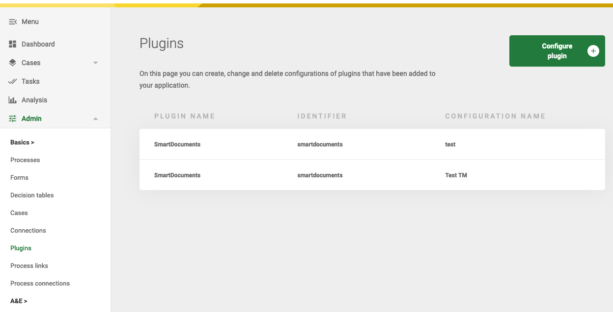

# Configuring Plugins

Plugins can be configured in the plugin menu in Valtimo. The plugin menu is found under the admin menu. Admin privileges
are required to configure plugins.

Instructions for using the configuration to link an action to a process task can be found 
[here](create-process-link.md).

## Setup
Before plugins can be configured, both the backend and frontend dependencies are needed. 
See [here](valtimo-documentation/getting-started/modules/core/plugin.md) for instructions on how to do this.

## Adding plugin configuration

1. Go to the Admin menu
2. Go to the Plugin menu
3. Click the button 'Configure plugin +'
4. Select the plugin definition
5. Configure the plugin

