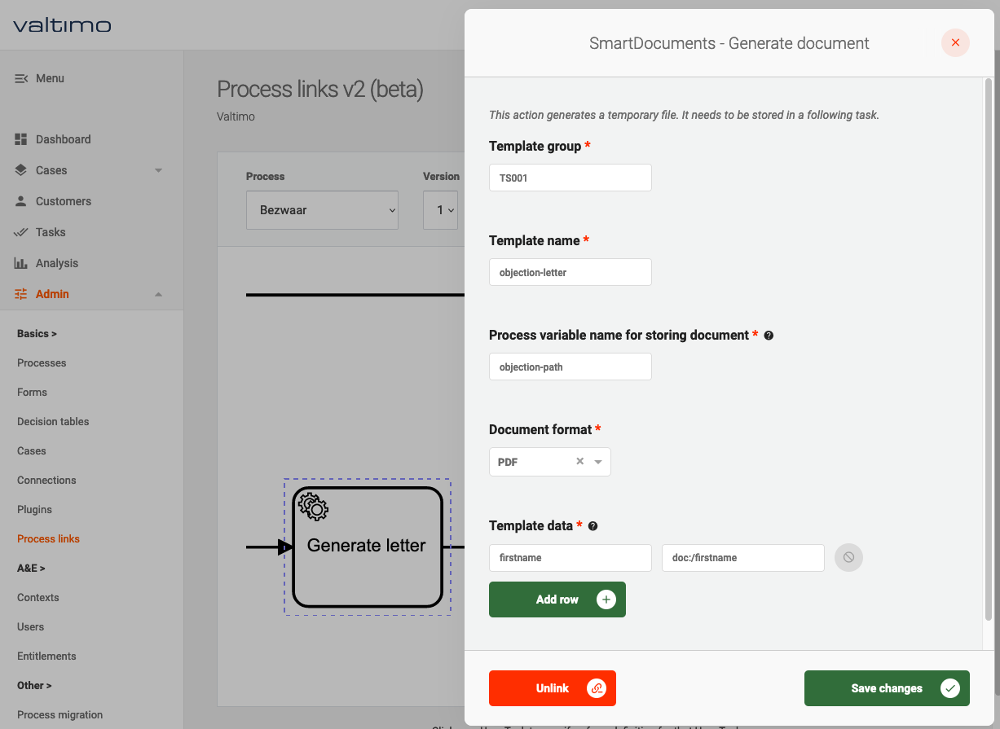

# Deleting a process link

Plugin actions that have been attached to Camunda activities, can also be detached. A process link can be deleted in the
process link menu. The process link menu is found under the admin menu. Admin privileges are required to configure
process links.

1. Go to the Admin menu
2. Go to the 'Process connection' menu
3. Select the task of the desired process
4. Click the 'Unlink' button

