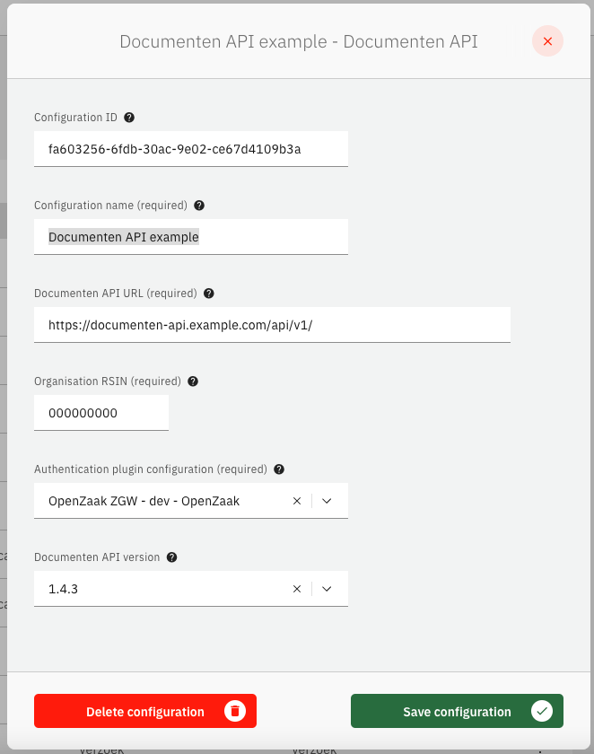
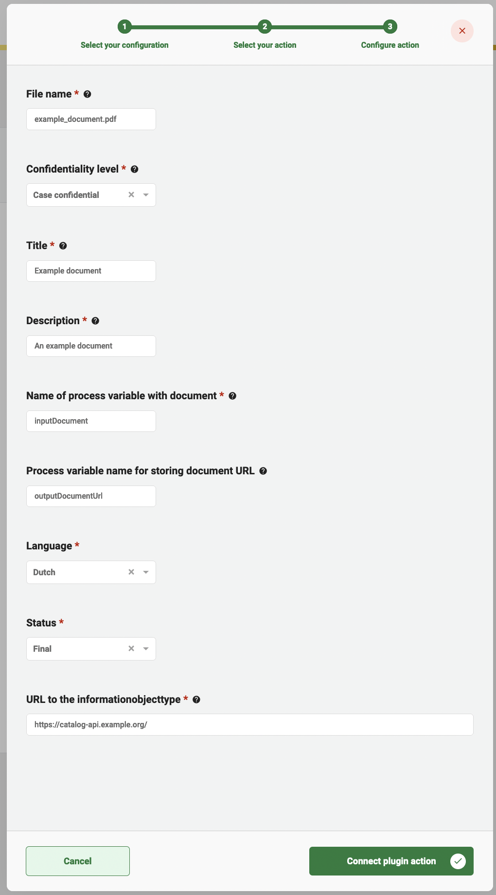

# Using the Documenten API Plugin

The Documenten API plugin can be used to store documents and their metadata in an application that supports the
Documenten API standard created and used by the Dutch government.

## Configure the plugin

In order to use this plugin a configuration has to be created. A general description on how to configure
plugins can be found [here](../configure-plugin.md).

If the Documenten API plugin is not visible in the plugin menu, it is possible the application is missing a dependency.
Instructions on how to add the Documenten API dependency can be found
[here](../../../valtimo-implementation/modules/documenten-api.md)

To configure this plugin the following properties have to be entered:
- The `Documenten API URL` property should contain the complete base URL of the Documenten API to connect to. This 
generally includes the path `/api/v1/`.
- The `Organisation RSIN` property should contain the RSIN of the organisation. The RSIN number (Rechtspersonen en 
Samenwerkingsverbanden Identificatie Nummer in Dutch) is an identification number for legal entities and partnerships.
This will be used when storing document to indicate who is responsible for creating the Document record in the API.
- The `Authentication plugin configuration` is a reference to another plugin configuration that will be used to add 
authentication to any request performed on the Documenten API. If no option is available in this field a plugin has to 
be configured that is able to authenticate for the specific application that hosts the Documenten API. (e.g. OpenZaak)

An example plugin configuration:

## Available actions

The Documenten API plugin supports the following actions that can be configured in process links in order to store 
documents and their metadata. 

A general description on how to create process links, can be found [here](../create-process-link.md).

### Save document

The `Save document` action takes a file from the local temporary storage and stores it in the Documenten API as a new 
Document. The document to be stored is assumed to have a reference stored in a process variable. After storing the 
document, the resulting document URL will be saved in a process variable.

When creating a process link the following properties have to be entered:
- `Name of process variable with document` The name of the process variable in which the ID of a local file in the 
temporary file storage has been stored.  
- `Process variable name for storing document URL` The name of the process variable in which the resulting document URL 
will be stored.
- `Language` The language of the document.
- `Status` The status of the document. Possible values are `Editing`, `To be confirmed`, `Final` and `Archived` as per 
the Documenten API standard.
- `Information object type` This is the type of the document. It has to be the complete URL referring to the document 
type (or informatieobjecttype) in the Catalogi API. (e.g. https://catalogi-api.example.org/api/v1/informatieobjecttypen/d4acf297-978d-4b2c-a9d3-5efd010ebcb2)

An example process link configuration:

